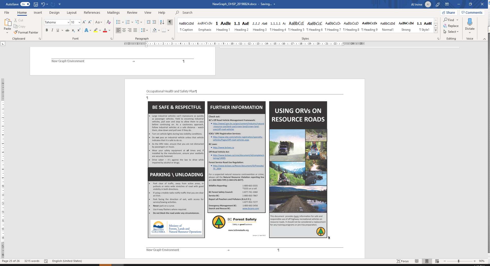

# Safe Work Procedures

## Driving {#driving .Style1}

### PROCEDURES AND PRACTICES:

-   Conduct a "pre-trip" vehicle check. Use a Vehicle Pre-trip
    Inspection and Mileage Log to track activity.

-   Report deficiencies and do not use if equipment is in unsafe
    condition.

-   Make notes of required maintenance in the mileage logbook when it is
    required and include "checking the logbook for required repairs" at
    the time of each inspection.

-   Drive defensively at all times.

-   Ensure all vehicle occupants are wearing seatbelts. You are
    responsible for your passengers.

-   Do not exceed posted speed limits.

-   On resource roads do not exceed 80kph or posted speed limits.

-   Drive safely and drive to the existing road conditions. Lower speed
    as required. Be aware of:

    -   Visibility reduced by dust, fog, rain and snow;

    -   Narrow roads with over width vehicles;

    -   Steep favorable and adverse gradients;

    -   Slippery and variable road surface conditions due to loose
        gravel, snow, ice or mud;

    -   Other users.

-   Use vehicle for intended use only (purpose and weight limitations).

-   Drive with vehicle lights on at all times.

-   Secure all heavy or sharp objects in the cab of the vehicle.

-   Respect that loaded logging trucks have the right of way on single
    lane roads.

-   Do not tailgate other vehicles.

-   Pass trucks or equipment only after you receive a clearly visible
    and/or audible signal from the operator.

-   Never chase a runaway vehicle.

-   Stay on your side of the road.

    **COVID 19 (COVID)**

    -   [Self-assess daily for COVID
        symptoms](https://bc.thrive.health/covid19/en) and self-isolate
        and test if you have symptoms.

    -   When possible, travel in separate vehicles. When a crew is
        required to travel together, sit in seats as far from eachother
        as possible, wear masks and when possible leave the windows open
        for good ventilation.

    -   All vehicles need to have paper towel, min 70% alcohol hand
        sanitizer and non-medical grade masks. Ensure this is present
        before leaving.

    -   When getting in vehicle wipe down all initial touch points with
        min 70% alcohol and paper towel (ex. Vehicle door, radio,
        steering wheel, shifter, seat belt). Sanitize all surfaces of
        both hands.

    -   After opening vehicle door at all stops and worksites use hand
        sanitizer on surfaces of both hands. Put on non-medical mask if
        entering building (ex. Gas station, restaurants) or working with
        others where you cannot keep min 2m distance. Upon exiting
        vehicle close door with elbow.

### RADIO USE:

-   Complete radio check and ensure correct frequency prior to entering
    radio controlled area.

-   Do not drive by the radio. Expect oncoming traffic at all times.

-   Call your position according to the local radio protocol and
    signage.

-   Notify other radio equipped vehicles of oncoming non-radio equipped
    traffic.

-   Do not use road radio channels for conversations, use only for road
    traffic protocols.

-   Other than traffic control, pull over and safely park when talking
    on the radio/cell phone for an extended period of time.

### PARKING:

-   Park clear of traffic, away from active areas in pullouts or extra
    wide straight sections of road.

-   Park facing the direction of exit with access for service/towing
    activities.

-   Ensure the parking brake is on and the transmission is in 1st gear
    or park.

-   On steep grades, use wheel chocks and always turn the wheels towards
    the nearest ditch.

-   Never park on a curve especially on the outside curve of a road.

-   When turning around, back into the cut bank of the road and not
    towards the outside bank.

-   Use flares where required.

## All-terrain vehicles {#all-terrain-vehicles .Style1}

{width="7.958500656167979in"
height="6.036744313210849in"}

{width="8.521936789151356in"
height="6.4813320209973755in"}

## Electrofishing {#electrofishing .Style1}

### Preparatory Procedures

1.  A crew leader must be designated for all backpack electrofishing
    activities.

2.  It is the crew leader's responsibility to ensure that all equipment
    is in "safe working order".

3.  An emergency response plan must be prepared and reviewed with all
    crew members.

4.  The crew leader must ensure all crew members have received
    instruction in the fundamentals of electrofishing safety.

5.  The crew leader and at least one additional crew member must have
    up-to-date CPR and First Aid training.

6.  Each electrofishing site must be visually inspected for hazards such
    as deep holes, submerged logs, etc. before commencing electrofishing
    operations.

7.  In order to aid in identifying underwater hazards, all crew members
    must be equipped with polarized sunglasses. Glasses also protect
    against eye injury caused by sticks and branches. Wide brimmed hats
    or peaked caps are also beneficial in increasing the effectiveness
    of polarized glasses.

8.  All crew members must be equipped with long armed gloves that are
    non-conductive, waterproof and inspected to be free of leaks. Gloves
    must be worn at all times during electrofishing operations.

9.  All crew members must be equipped with chest waders that are
    non-conductive, waterproof and inspected to be free of leaks. Chest
    waders must be worn at all times during electrofishing operations by
    team members entering the water. Wading belts are to be worn at all
    times.

10. All crew members must agree on a system of communication during
    electrofishing operations.

11. Backpack electrofishing units must be turned off and the battery
    disconnected before making any connections or part replacements.
    Start-up Procedures

12. All crew members must be notified and acknowledge their preparedness
    prior to the commencement of electrofishing operations. The unit
    operator must make sure that personnel are clear of the anode before
    turning on the power. Hand signals are a useful way of conveying
    these messages.

13. Check operation of all switches and gauges. This should include high
    voltage check, anode switch, power switch and mercury tilt switch,
    audible tone generator and light. Set controls to appropriate
    levels. The minimum voltage possible to obtain the desired results
    should be used to avoid excessive harm to the biota and to minimize
    the effects of accidental shock.

### Operational Procedures

14. Operate slowly and carefully. Footing in most streams is poor and
    most falls occur when crew members are hurrying. Operations should
    cease when fatigue sets in.

15. Team members must not place their hand(s) into the water when the
    power is turned on.

16. Electrofishing units must be shut off prior to entering or leaving
    the water and the battery terminals disconnected (or generator shut
    off) when not in use or when transporting the unit.

17. Life jackets or Personal Floatation Devices (PFDs) must be worn
    where the crew leader considers the water is of sufficient depth or
    velocity for a life jacket or PFD to be effective as protection from
    risk of drowning. Life jackets and PFDs must be approved by
    Transport Canada or Canadian Coast Guard. Electrofishing should not
    be carried out where water depth is greater than waist deep.

18. A crew member must immediately leave the water if wetness is
    detected in gloves or waders (by leaks, rain or perspiration) and
    obtain dry equipment before returning. Mild dampness from
    perspiration or humidity is considered normal.

19. Electrofishing operations must cease during inclement weather. (e.g.
    periods of any lightning or moderate rain).

**COVID 19**

-   As electrofishing often requires the "fisher" and "netter" to be
    within 2m of eachother masks are required to be worn by both crew
    members.

-   Wear disposable gloves when assembling equipment or wipe down all
    touch points after assembly.

## Boats {#boats .Style1}

## Culvert assessments and habitat confirmation assessments {#culvert-assessments-and-habitat-confirmation-assessments .Style1}

See driving procedures including radio use and parking.

-   Sometime parking on the shoulder of resource roads is the only
    practical way to assess a site. When doing so place a traffic cone
    2m behind the back left wheel to alert oncoming traffic.

-   Wear waders and wading boots or a non-slip rubber boot when working
    in the stream. Carefully assess your footing and be ready for
    slippery surfaces.

-   Use 2 walking poles when conducting in stream surveys. This allows
    for much greater stability and avoids the risk of injury. As the in
    stream substrate typically consists of cobbles and boulders, it can
    be very painful when falling. Poles are often used in photos to have
    a frame of reference for measurements of stream characteristics. One
    pole can be used for scale, while the other one can remain in hand
    as a stabilizer.

-   Carry bear spray with you at all times when in the field. You never
    know when you'll need to use it.

-   Always carry personal first aid kit, water, extra clothes, inreach
    satellite communicator and food (ex. Power bar) in your vest in case
    of an emergency.

-   High visibility field vest should be worn to avoid being mistaken
    for an animal by hunters.

-   When separated from crew members and working alone, it is critical
    that you carry a satellite communicator and walkie-talkie to
    communicate and check in with crew. It is also wise to arrange a
    meet up time and place before separated. Additionally, you must also
    carry bear spray. Make a lot of noise periodically to alert bears in
    the area of your presence. Optionally, it can be effective to have a
    bluetooth speaker to play music.

-   Navigating to sites often requires the use of handheld devices such
    as phones, two-way radios or GPS which should either be used by a
    non-driving crew member or mounted on the windshield where they can
    be viewed without distracting the driver.

-   Touching base with the call in person throughout the day is
    essential so that your last known location is known and to minimize
    the potential for false alarms should you not check in on time at
    the end of the day. Inreaches should be tested between crew members
    and between crew members and check in people before going in the
    field.

## Bears {#bears .Style1}

+---------------------+-----------------------------------------------+
| **Situation**       | **Recommended actions**                       |
+=====================+===============================================+
| Bear does not know  | Move away undetected.  Go back the way you    |
| you are there       | came or take large detour around. If you must |
|                     | go ahead do so slowly and cautiously. DO NOT  |
|                     | RUN                                           |
|                     |                                               |
|                     | Keep your eye on the bear.                    |
|                     |                                               |
|                     | Watch for changes in behavior.                |
|                     |                                               |
|                     | Be careful not to crowd or surprise bear      |
|                     | (especially Grizzlies).  Do not shout if it   |
|                     | is unaware of your presence.                  |
+---------------------+-----------------------------------------------+
| Bear becomes aware  | Calmly and from as far away as possible       |
| of you              | identify yourself as human.                   |
|                     |                                               |
|                     | Talk to the bear in a low, respectful voice.  |
|                     |                                               |
|                     | Wave your arms slowly.                        |
|                     |                                               |
|                     | Increase the distance between you and the     |
|                     | bear.                                         |
|                     |                                               |
|                     | If possible, move upwind to give the bear     |
|                     | your scent.                                   |
|                     |                                               |
|                     | When bear is aware and unconcerned take the   |
|                     | opportunity to leave. Do not run.             |
+---------------------+-----------------------------------------------+
| If you hear bear    | Be extremely cautious and leave the area the  |
| vocalizations or    | way you came.                                 |
| see young bears in  |                                               |
| area                |                                               |
+---------------------+-----------------------------------------------+
| If bear approaches  | Stop, stay calm, and assess the situation: is |
| you                 | bear acting defensively (grunting, or another |
|                     | way?                                          |
|                     |                                               |
|                     | Don't run.                                    |
|                     |                                               |
|                     | Group together if possible.  Prepare          |
|                     | deterrent (mace).                             |
|                     |                                               |
|                     | Determine if bear is **defensive or           |
|                     | aggressive.**                                 |
+---------------------+-----------------------------------------------+
| Bear approaching in | **Defensive bears are threatened or may be    |
| a defensive         | protecting food. They show stressed behaviour |
| (stressed) manner   | such as rapid huffing, salivating, roaring,   |
|                     | paw slapping, guttural noises, open mouthed   |
|                     | jawing and charging.**                        |
|                     |                                               |
|                     | When bear approaches or charges stand your    |
|                     | ground (physical contact is rare). Most       |
|                     | charges stop short.                           |
|                     |                                               |
|                     | Appear non-threatening.                       |
|                     |                                               |
|                     | Talk to bear in calm voice and let it know    |
|                     | you mean it no harm.                          |
|                     |                                               |
|                     | Don't shout or throw things acting            |
|                     | defensively.  Try to increase distance        |
|                     | between you and the bear (keep your eye on    |
|                     | it).  Do not run.                             |
|                     |                                               |
|                     | Use deterrent only as last defense.           |
+---------------------+-----------------------------------------------+
| In the case of a    | If bear physically contacts you in a          |
| defensive attack    | defensive attack play dead: fall on ground on |
|                     | your front, protect your neck.  If rolled     |
|                     | over continue to roll over to face.  Stay on  |
|                     | ground till bear leaves.  If attach is        |
|                     | prolonged it is no longer defensive.          |
+---------------------+-----------------------------------------------+
| Bear approaching in | **Non defensive bears show little stress.     |
| **non-defensive**   | They look interested in you and intent on     |
| manner              | approaching you. Watch towards you            |
|                     | confidently looking towards you               |
|                     | intermittently. They seem intent on attack.** |
|                     |                                               |
|                     | If approached move away from bears path or    |
|                     | trail.                                        |
|                     |                                               |
|                     | If bear is intent on you stand your ground.   |
|                     | **Your response needs to be assertive.**      |
|                     |                                               |
|                     | Act aggressively: shout at bear, stare it in  |
|                     | the eye, stamp feet, stand on stump or log,   |
|                     | threaten bear with stick or log.              |
|                     |                                               |
|                     | If attacked use deterrent, fight with any     |
|                     | weapon available with all your strength.      |
|                     | Focus attack on bear's face.                  |
+---------------------+-----------------------------------------------+

Staying safe in bear country video:
<https://www.youtube.com/watch?v=s-zkGuh42l4&ab_channel=bearbiology>

# Appendixes

## Appendix 4 - First Aid Requirements {.unnumbered}

**Table 1**: This table applies to a workplace that an employer
determines under section 3.16 (2) (b) of the Regulation creates a low
risk of injury and that is more than 20 minutes surface travel time away
from a hospital.

+------------+------------+------------+------------+------------+
| **It em**  | **Column   | **Column   | **Column   | **Column   |
|            | 1\         | 2\         | 3\         | 4\         |
|            | Number of  | Supplies,  | Level of   | Transp     |
|            | workers    | equipment, | first aid  | ortation** |
|            | per        | and        | c          |            |
|            | shift**    | facility** | ertificate |            |
|            |            |            | for        |            |
|            |            |            | a          |            |
|            |            |            | ttendant** |            |
+============+============+============+============+============+
| 1          | 1          | Personal   |            |            |
|            |            | first aid  |            |            |
|            |            | kit        |            |            |
+------------+------------+------------+------------+------------+
| 2          | 2-5        | Basic      |            |            |
|            |            | first aid  |            |            |
|            |            | kit        |            |            |
+------------+------------+------------+------------+------------+
| 3          | 6-30       | Level 1    | Level 1    |            |
|            |            | first aid  | c          |            |
|            |            | kit        | ertificate |            |
+------------+------------+------------+------------+------------+
| 4          | 31-50      | Level 1    | Level 1    |            |
|            |            | first aid  | c          |            |
|            |            | kit        | ertificate |            |
|            |            |            | with Tr    |            |
|            |            | -   ETV    | an         |            |
|            |            |            | sportation |            |
|            |            | equipment  | E          |            |
|            |            |            | ndorsement |            |
+------------+------------+------------+------------+------------+
| 5          | 51-75      | Level 3    | Level 3    |            |
|            |            | first aid  | c          |            |
|            |            | kit        | ertificate |            |
|            |            |            |            |            |
|            |            | -          |            |            |
|            |            |   Dressing |            |            |
|            |            |            |            |            |
|            |            |            |            |            |
|            |            |    station |            |            |
|            |            |            |            |            |
|            |            | ETV        |            |            |
|            |            | equipment  |            |            |
+------------+------------+------------+------------+------------+
| 6          | 76 or more | Level 3    | Level 3    | ETV        |
|            |            | first aid  | c          |            |
|            |            | kit        | ertificate |            |
|            |            |            |            |            |
|            |            | -   First  |            |            |
|            |            |     aid    |            |            |
|            |            |     room   |            |            |
|            |            |            |            |            |
|            |            | ETV        |            |            |
|            |            | equipment  |            |            |
+------------+------------+------------+------------+------------+

**Table 2**: This table applies to a workplace that an employer
determines under section 3.16 (2) (b) of the Regulation creates a low
risk of injury and that is 20 minutes or less surface travel time away
from a hospital.

+------------+------------+------------+------------+------------+
| **It em**  | **Column   | **Column   | **Column   | **Column   |
|            | 1\         | 2\         | 3\         | 4\         |
|            | Number of  | Supplies,  | Level of   | Transp     |
|            | workers    | equipment, | first aid  | ortation** |
|            | per        | and        | c          |            |
|            | shift**    | facility** | ertificate |            |
|            |            |            | for        |            |
|            |            |            | a          |            |
|            |            |            | ttendant** |            |
+============+============+============+============+============+
| 1          | 1          |            |            |            |
+------------+------------+------------+------------+------------+
| 2          | 2-10       | Basic      |            |            |
|            |            | first aid  |            |            |
|            |            | kit        |            |            |
+------------+------------+------------+------------+------------+
| 3          | 11-50      | Level 1    | Level 1    |            |
|            |            | first aid  | c          |            |
|            |            | kit        | ertificate |            |
+------------+------------+------------+------------+------------+
| 4          | 51-100     | Level 2    | \*Level 2  |            |
|            |            | first aid  | c          |            |
|            |            | kit        | ertificate |            |
|            |            |            |            |            |
|            |            | -          |            |            |
|            |            |   Dressing |            |            |
|            |            |            |            |            |
|            |            |            |            |            |
|            |            |    station |            |            |
+------------+------------+------------+------------+------------+
| 5          | 101 or     | Level 2    | \*Level 2  |            |
|            | more       | first aid  | c          |            |
|            |            | kit        | ertificate |            |
|            |            |            |            |            |
|            |            | -   First  |            |            |
|            |            |     aid    |            |            |
|            |            |     room   |            |            |
+------------+------------+------------+------------+------------+

**Table 3**: This table applies to a workplace that an employer
determines under section 3.16 (2) (b) of the Regulation creates a
moderate risk of injury and that is more than 20 minutes surface travel
time away from a hospital.

+------------+------------+------------+------------+------------+
| **It em**  | **Column   | **Column   | **Column   | **Column   |
|            | 1\         | 2\         | 3\         | 4\         |
|            | Number of  | Supplies,  | Level of   | Transp     |
|            | workers    | equipment, | first aid  | ortation** |
|            | per        | and        | c          |            |
|            | shift**    | facility** | ertificate |            |
|            |            |            | for        |            |
|            |            |            | a          |            |
|            |            |            | ttendant** |            |
+============+============+============+============+============+
| 1          | 1          | Personal   |            |            |
|            |            | first aid  |            |            |
|            |            | kit        |            |            |
+------------+------------+------------+------------+------------+
| 2          | 2-5        | Level 1    | Level 1    |            |
|            |            | first aid  | c          |            |
|            |            | kit        | ertificate |            |
+------------+------------+------------+------------+------------+
| 3          | 6-15       | Level 1    | Level 1    |            |
|            |            | first aid  | c          |            |
|            |            | kit        | ertificate |            |
|            |            |            | with Tr    |            |
|            |            | -   ETV    | an         |            |
|            |            |            | sportation |            |
|            |            | equipment  | E          |            |
|            |            |            | ndorsement |            |
+------------+------------+------------+------------+------------+
| 4          | 16-50      | Level 3    | Level 3    |  ETV       |
|            |            | first aid  | c          |            |
|            |            | kit        | ertificate |            |
|            |            |            |            |            |
|            |            | -          |            |            |
|            |            |   Dressing |            |            |
|            |            |            |            |            |
|            |            |            |            |            |
|            |            |    station |            |            |
|            |            |            |            |            |
|            |            | -   ETV    |            |            |
|            |            |            |            |            |
|            |            | equipment  |            |            |
+------------+------------+------------+------------+------------+
| 5          | 51-100     | Level 3    | Level 3    |  ETV       |
|            |            | first aid  | c          |            |
|            |            | kit        | ertificate |            |
|            |            |            |            |            |
|            |            | -   First  |            |            |
|            |            |     aid    |            |            |
|            |            |     room   |            |            |
|            |            |            |            |            |
|            |            | -   ETV    |            |            |
|            |            |            |            |            |
|            |            | equipment  |            |            |
+------------+------------+------------+------------+------------+
| 6          | 101-300    | Level 3    | Level 3    | Industrial |
|            |            | first aid  | c          | ambulance  |
|            |            | kit        | ertificate |            |
|            |            |            |            |            |
|            |            | -   First  |            |            |
|            |            |     aid    |            |            |
|            |            |     room   |            |            |
|            |            |            |            |            |
|            |            | -          |            |            |
|            |            | Industrial |            |            |
|            |            |            |            |            |
|            |            |            |            |            |
|            |            |  ambulance |            |            |
|            |            |            |            |            |
|            |            |            |            |            |
|            |            |  equipment |            |            |
+------------+------------+------------+------------+------------+
| 7          | 301 or     | Level 3    | 2          | Industrial |
|            | more       | first aid  | a          | ambulance  |
|            |            | kit        | ttendants, |            |
|            |            |            | each with  |            |
|            |            | -   First  | Level 3    |            |
|            |            |     aid    | ce         |            |
|            |            |     room   | rtificates |            |
|            |            |            |            |            |
|            |            | -          |            |            |
|            |            | Industrial |            |            |
|            |            |            |            |            |
|            |            |            |            |            |
|            |            |  ambulance |            |            |
|            |            |            |            |            |
|            |            |            |            |            |
|            |            |  equipment |            |            |
+------------+------------+------------+------------+------------+

**Table 4**: This table applies to a workplace that an employer
determines under section 3.16 (2) (b) of the Regulation creates a
moderate risk of injury and that is 20 minutes or less surface travel
time away from a hospital.

+------------+------------+------------+------------+------------+
| **It em**  | **Column   | **Column   | **Column   | **Column   |
|            | 1\         | 2\         | 3\         | 4\         |
|            | Number of  | Supplies,  | Level of   | Transp     |
|            | workers    | equipment, | first aid  | ortation** |
|            | per        | and        | c          |            |
|            | shift**    | facility** | ertificate |            |
|            |            |            | for        |            |
|            |            |            | a          |            |
|            |            |            | ttendant** |            |
+============+============+============+============+============+
| 1          | 1          | Personal   |            |            |
|            |            | first aid  |            |            |
|            |            | kit        |            |            |
+------------+------------+------------+------------+------------+
| 2          | 2-5        | Basic      |            |            |
|            |            | first aid  |            |            |
|            |            | kit        |            |            |
+------------+------------+------------+------------+------------+
| 3          | 6-25       | Level 1    | Level 1    |            |
|            |            | first aid  | c          |            |
|            |            | kit        | ertificate |            |
+------------+------------+------------+------------+------------+
| 4          | 26-75      | Level 2    | \*Level 2  |            |
|            |            | first aid  | c          |            |
|            |            | kit        | ertificate |            |
|            |            |            |            |            |
|            |            | -          |            |            |
|            |            |   Dressing |            |            |
|            |            |            |            |            |
|            |            |            |            |            |
|            |            |    station |            |            |
+------------+------------+------------+------------+------------+
| 5          | 76 or more | Level 2    | \*Level 2  |            |
|            |            | first aid  | c          |            |
|            |            | kit        | ertificate |            |
|            |            |            |            |            |
|            |            | -   First  |            |            |
|            |            |     aid    |            |            |
|            |            |     room   |            |            |
+------------+------------+------------+------------+------------+

**Table 5**: This table applies to a workplace that an employer
determines under section 3.16 (2) (b) of the Regulation creates a high
risk of injury and that is more than 20 minutes surface travel time away
from a hospital.

+------------+------------+------------+------------+------------+
| **It em**  | **Column   | **Column   | **Column   | **Column   |
|            | 1\         | 2\         | 3\         | 4\         |
|            | Number of  | Supplies,  | Level of   | Transp     |
|            | workers    | equipment, | first aid  | ortation** |
|            | per        | and        | c          |            |
|            | shift**    | facility** | ertificate |            |
|            |            |            | for        |            |
|            |            |            | a          |            |
|            |            |            | ttendant** |            |
+============+============+============+============+============+
| 1          | 1          | Personal   |            |            |
|            |            | first aid  |            |            |
|            |            | kit        |            |            |
+------------+------------+------------+------------+------------+
| 2          | 2-5        | Level 1    | Level 1    |            |
|            |            | first aid  | c          |            |
|            |            | kit        | ertificate |            |
+------------+------------+------------+------------+------------+
| 3          | 6-10       | Level 1    | Level 1    |  ETV       |
|            |            | first aid  | c          |            |
|            |            | kit        | ertificate |            |
|            |            |            | with Tr    |            |
|            |            | -   ETV    | an         |            |
|            |            |            | sportation |            |
|            |            | equipment  | E          |            |
|            |            |            | ndorsement |            |
+------------+------------+------------+------------+------------+
| 4          | 11-30      | Level 3    | Level 3    |  ETV       |
|            |            | first aid  | c          |            |
|            |            | kit        | ertificate |            |
|            |            |            |            |            |
|            |            | -          |            |            |
|            |            |   Dressing |            |            |
|            |            |            |            |            |
|            |            |            |            |            |
|            |            |    station |            |            |
+------------+------------+------------+------------+------------+
| 5          | 31-50      | Level 3    | Level 3    |  ETV       |
|            |            | first aid  | c          |            |
|            |            | kit        | ertificate |            |
|            |            |            |            |            |
|            |            | -   First  |            |            |
|            |            |     aid    |            |            |
|            |            |     room   |            |            |
|            |            |            |            |            |
|            |            | -   ETV    |            |            |
|            |            |            |            |            |
|            |            | equipment  |            |            |
+------------+------------+------------+------------+------------+
| 6          | 51-200     | Level 3    | Level 3    | Industrial |
|            |            | first aid  | c          | ambulance  |
|            |            | kit        | ertificate |            |
|            |            |            |            |            |
|            |            | -   First  |            |            |
|            |            |     aid    |            |            |
|            |            |     room   |            |            |
|            |            |            |            |            |
|            |            | -          |            |            |
|            |            | Industrial |            |            |
|            |            |            |            |            |
|            |            |            |            |            |
|            |            |  ambulance |            |            |
|            |            |            |            |            |
|            |            |            |            |            |
|            |            |  equipment |            |            |
+------------+------------+------------+------------+------------+
| 7          | 201 or     | Level 3    | 2          | Industrial |
|            | more       | first aid  | a          | ambulance  |
|            |            | kit        | ttendants, |            |
|            |            |            | each with  |            |
|            |            | -   First  | Level 3    |            |
|            |            |     aid    | ce         |            |
|            |            |     room   | rtificates |            |
|            |            |            |            |            |
|            |            | -          |            |            |
|            |            | Industrial |            |            |
|            |            |            |            |            |
|            |            |            |            |            |
|            |            |  ambulance |            |            |
|            |            |            |            |            |
|            |            |            |            |            |
|            |            |  equipment |            |            |
+------------+------------+------------+------------+------------+

## Appendix 5 - Contractor Selection and Safety Checklist {.unnumbered}

**Contractor Selection Form**

+---+---+---+
| C |   |   |
| o |   |   |
| n |   |   |
| t |   |   |
| r |   |   |
| a |   |   |
| c |   |   |
| t |   |   |
| : |   |   |
+===+===+===+
| N |   |   |
| a |   |   |
| m |   |   |
| e |   |   |
| o |   |   |
| f |   |   |
| C |   |   |
| o |   |   |
| n |   |   |
| t |   |   |
| r |   |   |
| a |   |   |
| c |   |   |
| t |   |   |
| o |   |   |
| r |   |   |
| : |   |   |
+---+---+---+
| A |   |   |
| d |   |   |
| d |   |   |
| r |   |   |
| e |   |   |
| s |   |   |
| s |   |   |
| : |   |   |
+---+---+---+
| P |   | F |
| h |   | a |
| o |   | x |
| n |   | : |
| e |   |   |
| : |   |   |
+---+---+---+
| W |   |   |
| o |   |   |
| r |   |   |
| k |   |   |
| S |   |   |
| a |   |   |
| f |   |   |
| e |   |   |
| B |   |   |
| C |   |   |
| E |   |   |
| m |   |   |
| p |   |   |
| l |   |   |
| o |   |   |
| y |   |   |
| e |   |   |
| r |   |   |
| I |   |   |
| D |   |   |
| : |   |   |
+---+---+---+
| W |   |   |
| o |   |   |
| r |   |   |
| k |   |   |
| S |   |   |
| a |   |   |
| f |   |   |
| e |   |   |
| B |   |   |
| C |   |   |
| c |   |   |
| u |   |   |
| r |   |   |
| r |   |   |
| e |   |   |
| n |   |   |
| t |   |   |
| s |   |   |
| t |   |   |
| a |   |   |
| n |   |   |
| d |   |   |
| i |   |   |
| n |   |   |
| g |   |   |
| ( |   |   |
| a |   |   |
| t |   |   |
| t |   |   |
| a |   |   |
| c |   |   |
| h |   |   |
| c |   |   |
| l |   |   |
| e |   |   |
| a |   |   |
| r |   |   |
| a |   |   |
| n |   |   |
| c |   |   |
| e |   |   |
| l |   |   |
| e |   |   |
| t |   |   |
| t |   |   |
| e |   |   |
| r |   |   |
| ) |   |   |
| : |   |   |
+---+---+---+
| W |   |   |
| o |   |   |
| r |   |   |
| k |   |   |
| S |   |   |
| a |   |   |
| f |   |   |
| e |   |   |
| B |   |   |
| C |   |   |
| a |   |   |
| s |   |   |
| s |   |   |
| e |   |   |
| s |   |   |
| s |   |   |
| m |   |   |
| e |   |   |
| n |   |   |
| t |   |   |
| r |   |   |
| a |   |   |
| t |   |   |
| e |   |   |
| ( |   |   |
| i |   |   |
| n |   |   |
| d |   |   |
| u |   |   |
| s |   |   |
| t |   |   |
| r |   |   |
| y |   |   |
| a |   |   |
| v |   |   |
| e |   |   |
| r |   |   |
| a |   |   |
| g |   |   |
| e |   |   |
| o |   |   |
| r |   |   |
| l |   |   |
| o |   |   |
| w |   |   |
| e |   |   |
| r |   |   |
| ) |   |   |
| : |   |   |
+---+---+---+
| D |   |   |
| e |   |   |
| s |   |   |
| c |   |   |
| r |   |   |
| i |   |   |
| p |   |   |
| t |   |   |
| i |   |   |
| o |   |   |
| n |   |   |
| o |   |   |
| f |   |   |
| w |   |   |
| r |   |   |
| i |   |   |
| t |   |   |
| t |   |   |
| e |   |   |
| n |   |   |
| W |   |   |
| o |   |   |
| r |   |   |
| k |   |   |
| S |   |   |
| a |   |   |
| f |   |   |
| e |   |   |
| B |   |   |
| C |   |   |
| o |   |   |
| r |   |   |
| d |   |   |
| e |   |   |
| r |   |   |
| s |   |   |
| i |   |   |
| n |   |   |
| p |   |   |
| a |   |   |
| s |   |   |
| t |   |   |
| 2 |   |   |
| 4 |   |   |
| m |   |   |
| o |   |   |
| n |   |   |
| t |   |   |
| h |   |   |
| s |   |   |
| : |   |   |
+---+---+---+
| R |   |   |
| e |   |   |
| f |   |   |
| e |   |   |
| r |   |   |
| e |   |   |
| n |   |   |
| c |   |   |
| e |   |   |
| s |   |   |
| : |   |   |
+---+---+---+
| P |   |   |
| r |   |   |
| e |   |   |
| v |   |   |
| i |   |   |
| o |   |   |
| u |   |   |
| s |   |   |
| w |   |   |
| o |   |   |
| r |   |   |
| k |   |   |
| h |   |   |
| i |   |   |
| s |   |   |
| t |   |   |
| o |   |   |
| r |   |   |
| y |   |   |
| : |   |   |
+---+---+---+
| U |   |   |
| s |   |   |
| i |   |   |
| n |   |   |
| g |   |   |
| t |   |   |
| h |   |   |
| e |   |   |
| p |   |   |
| r |   |   |
| e |   |   |
| v |   |   |
| i |   |   |
| o |   |   |
| u |   |   |
| s |   |   |
| y |   |   |
| e |   |   |
| a |   |   |
| r |   |   |
| \ |   |   |
| ' |   |   |
| s |   |   |
| e |   |   |
| x |   |   |
| p |   |   |
| e |   |   |
| r |   |   |
| i |   |   |
| e |   |   |
| n |   |   |
| c |   |   |
| e |   |   |
| , |   |   |
| c |   |   |
| o |   |   |
| m |   |   |
| p |   |   |
| l |   |   |
| e |   |   |
| t |   |   |
| e |   |   |
| t |   |   |
| h |   |   |
| e |   |   |
| f |   |   |
| o |   |   |
| l |   |   |
| l |   |   |
| o |   |   |
| w |   |   |
| i |   |   |
| n |   |   |
| g |   |   |
| : |   |   |
+---+---+---+
| N |   | N |
| u |   | u |
| m |   | m |
| b |   | b |
| e |   | e |
| r |   | r |
| o |   | o |
| f |   | f |
| f |   | r |
| i |   | e |
| r |   | c |
| s |   | o |
| t |   | r |
| a |   | d |
| i |   | a |
| d |   | b |
| c |   | l |
| a |   | e |
| s |   | i |
| e |   | n |
| s |   | c |
| : |   | i |
|   |   | d |
|   |   | e |
|   |   | n |
|   |   | t |
|   |   | s |
|   |   | : |
+---+---+---+
| N |   | N |
| u |   | u |
| m |   | m |
| b |   | b |
| e |   | e |
| r |   | r |
| o |   | o |
| f |   | f |
| l |   | l |
| o |   | o |
| s |   | s |
| t |   | t |
| t |   | d |
| i |   | a |
| m |   | y |
| e |   | s |
| c |   | : |
| a |   |   |
| s |   |   |
| e |   |   |
| s |   |   |
| : |   |   |
+---+---+---+
| S |   |   |
| e |   |   |
| v |   |   |
| e |   |   |
| r |   |   |
| i |   |   |
| t |   |   |
| y |   |   |
| R |   |   |
| a |   |   |
| t |   |   |
| e |   |   |
| ( |   |   |
| [ |   |   |
| \ |   |   |
| \ |   |   |
| # |   |   |
| o |   |   |
| f |   |   |
| d |   |   |
| a |   |   |
| y |   |   |
| s |   |   |
| l |   |   |
| o |   |   |
| s |   |   |
| t |   |   |
| X |   |   |
| 2 |   |   |
| 0 |   |   |
| 0 |   |   |
| , |   |   |
| 0 |   |   |
| 0 |   |   |
| 0 |   |   |
| ] |   |   |
| { |   |   |
| . |   |   |
| u |   |   |
| n |   |   |
| d |   |   |
| e |   |   |
| r |   |   |
| l |   |   |
| i |   |   |
| n |   |   |
| e |   |   |
| } |   |   |
| ) |   |   |
| : |   |   |
+---+---+---+
| - |   |   |
|   |   |   |
|   |   |   |
|   |   |   |
| T |   |   |
|   |   |   |
|   |   |   |
|   |   |   |
|   |   |   |
| o |   |   |
|   |   |   |
|   |   |   |
|   |   |   |
|   |   |   |
| t |   |   |
|   |   |   |
|   |   |   |
|   |   |   |
|   |   |   |
| a |   |   |
|   |   |   |
|   |   |   |
|   |   |   |
|   |   |   |
| l |   |   |
|   |   |   |
|   |   |   |
|   |   |   |
|   |   |   |
| h |   |   |
|   |   |   |
|   |   |   |
|   |   |   |
|   |   |   |
| o |   |   |
|   |   |   |
|   |   |   |
|   |   |   |
|   |   |   |
| u |   |   |
|   |   |   |
|   |   |   |
|   |   |   |
|   |   |   |
| r |   |   |
|   |   |   |
|   |   |   |
|   |   |   |
|   |   |   |
| s |   |   |
|   |   |   |
|   |   |   |
|   |   |   |
|   |   |   |
| w |   |   |
|   |   |   |
|   |   |   |
|   |   |   |
|   |   |   |
| o |   |   |
|   |   |   |
|   |   |   |
|   |   |   |
|   |   |   |
| r |   |   |
|   |   |   |
|   |   |   |
|   |   |   |
|   |   |   |
| k |   |   |
|   |   |   |
|   |   |   |
|   |   |   |
|   |   |   |
| e |   |   |
|   |   |   |
|   |   |   |
|   |   |   |
|   |   |   |
| d |   |   |
| - |   |   |
|   |   |   |
|   |   |   |
|   |   |   |
+---+---+---+
| E |   |   |
| x |   |   |
| p |   |   |
| o |   |   |
| s |   |   |
| u |   |   |
| r |   |   |
| e |   |   |
| H |   |   |
| o |   |   |
| u |   |   |
| r |   |   |
| s |   |   |
+---+---+---+
| M |   |   |
| e |   |   |
| d |   |   |
| i |   |   |
| c |   |   |
| a |   |   |
| l |   |   |
| I |   |   |
| n |   |   |
| c |   |   |
| i |   |   |
| d |   |   |
| e |   |   |
| n |   |   |
| t |   |   |
| R |   |   |
| a |   |   |
| t |   |   |
| e |   |   |
| ( |   |   |
| M |   |   |
| I |   |   |
| R |   |   |
| = |   |   |
| [ |   |   |
| \ |   |   |
| \ |   |   |
| # |   |   |
| o |   |   |
| f |   |   |
| r |   |   |
| e |   |   |
| c |   |   |
| o |   |   |
| r |   |   |
| d |   |   |
| a |   |   |
| b |   |   |
| l |   |   |
| e |   |   |
| i |   |   |
| n |   |   |
| c |   |   |
| i |   |   |
| d |   |   |
| e |   |   |
| n |   |   |
| t |   |   |
| s |   |   |
| X |   |   |
| 2 |   |   |
| 0 |   |   |
| 0 |   |   |
| , |   |   |
| 0 |   |   |
| 0 |   |   |
| 0 |   |   |
| ] |   |   |
| { |   |   |
| . |   |   |
| u |   |   |
| n |   |   |
| d |   |   |
| e |   |   |
| r |   |   |
| l |   |   |
| i |   |   |
| n |   |   |
| e |   |   |
| } |   |   |
| ) |   |   |
| : |   |   |
+---+---+---+
| - |   |   |
|   |   |   |
|   |   |   |
|   |   |   |
| T |   |   |
|   |   |   |
|   |   |   |
|   |   |   |
|   |   |   |
| o |   |   |
|   |   |   |
|   |   |   |
|   |   |   |
|   |   |   |
| t |   |   |
|   |   |   |
|   |   |   |
|   |   |   |
|   |   |   |
| a |   |   |
|   |   |   |
|   |   |   |
|   |   |   |
|   |   |   |
| l |   |   |
|   |   |   |
|   |   |   |
|   |   |   |
|   |   |   |
| h |   |   |
|   |   |   |
|   |   |   |
|   |   |   |
|   |   |   |
| o |   |   |
|   |   |   |
|   |   |   |
|   |   |   |
|   |   |   |
| u |   |   |
|   |   |   |
|   |   |   |
|   |   |   |
|   |   |   |
| r |   |   |
|   |   |   |
|   |   |   |
|   |   |   |
|   |   |   |
| s |   |   |
|   |   |   |
|   |   |   |
|   |   |   |
|   |   |   |
| w |   |   |
|   |   |   |
|   |   |   |
|   |   |   |
|   |   |   |
| o |   |   |
|   |   |   |
|   |   |   |
|   |   |   |
|   |   |   |
| r |   |   |
|   |   |   |
|   |   |   |
|   |   |   |
|   |   |   |
| k |   |   |
|   |   |   |
|   |   |   |
|   |   |   |
|   |   |   |
| e |   |   |
|   |   |   |
|   |   |   |
|   |   |   |
|   |   |   |
| d |   |   |
| - |   |   |
|   |   |   |
|   |   |   |
|   |   |   |
+---+---+---+
| E |   |   |
| x |   |   |
| p |   |   |
| o |   |   |
| s |   |   |
| u |   |   |
| r |   |   |
| e |   |   |
| H |   |   |
| o |   |   |
| u |   |   |
| r |   |   |
| s |   |   |
+---+---+---+
| N |   |   |
| u |   |   |
| m |   |   |
| b |   |   |
| e |   |   |
| r |   |   |
| o |   |   |
| f |   |   |
| f |   |   |
| a |   |   |
| t |   |   |
| a |   |   |
| l |   |   |
| i |   |   |
| t |   |   |
| i |   |   |
| e |   |   |
| s |   |   |
| i |   |   |
| n |   |   |
| t |   |   |
| h |   |   |
| e |   |   |
| l |   |   |
| a |   |   |
| s |   |   |
| t |   |   |
| f |   |   |
| i |   |   |
| v |   |   |
| e |   |   |
| y |   |   |
| e |   |   |
| a |   |   |
| r |   |   |
| s |   |   |
| : |   |   |
+---+---+---+
| H |   |   |
| o |   |   |
| w |   |   |
| o |   |   |
| f |   |   |
| t |   |   |
| e |   |   |
| n |   |   |
| a |   |   |
| r |   |   |
| e |   |   |
| s |   |   |
| a |   |   |
| f |   |   |
| e |   |   |
| t |   |   |
| y |   |   |
| m |   |   |
| e |   |   |
| e |   |   |
| t |   |   |
| i |   |   |
| n |   |   |
| g |   |   |
| s |   |   |
| h |   |   |
| e |   |   |
| l |   |   |
| d |   |   |
| w |   |   |
| i |   |   |
| t |   |   |
| h |   |   |
| e |   |   |
| m |   |   |
| p |   |   |
| l |   |   |
| o |   |   |
| y |   |   |
| e |   |   |
| e |   |   |
| s |   |   |
| : |   |   |
+---+---+---+
| A |   |   |
| r |   |   |
| e |   |   |
| w |   |   |
| o |   |   |
| r |   |   |
| k |   |   |
| s |   |   |
| i |   |   |
| t |   |   |
| e |   |   |
| i |   |   |
| n |   |   |
| s |   |   |
| p |   |   |
| e |   |   |
| c |   |   |
| t |   |   |
| i |   |   |
| o |   |   |
| n |   |   |
| s |   |   |
| h |   |   |
| e |   |   |
| l |   |   |
| d |   |   |
| : |   |   |
+---+---+---+
| - |   |   |
|   |   |   |
|   |   |   |
|   |   |   |
|   |   |   |
| - |   |   |
|   |   |   |
|   |   |   |
|   |   |   |
| A |   |   |
|   |   |   |
|   |   |   |
|   |   |   |
|   |   |   |
| t |   |   |
|   |   |   |
|   |   |   |
|   |   |   |
|   |   |   |
| t |   |   |
|   |   |   |
|   |   |   |
|   |   |   |
|   |   |   |
| a |   |   |
|   |   |   |
|   |   |   |
|   |   |   |
|   |   |   |
| c |   |   |
|   |   |   |
|   |   |   |
|   |   |   |
|   |   |   |
| h |   |   |
|   |   |   |
|   |   |   |
|   |   |   |
|   |   |   |
| a |   |   |
|   |   |   |
|   |   |   |
|   |   |   |
|   |   |   |
| c |   |   |
|   |   |   |
|   |   |   |
|   |   |   |
|   |   |   |
| o |   |   |
|   |   |   |
|   |   |   |
|   |   |   |
|   |   |   |
| p |   |   |
|   |   |   |
|   |   |   |
|   |   |   |
|   |   |   |
| y |   |   |
|   |   |   |
|   |   |   |
|   |   |   |
|   |   |   |
| o |   |   |
|   |   |   |
|   |   |   |
|   |   |   |
|   |   |   |
| f |   |   |
|   |   |   |
|   |   |   |
|   |   |   |
|   |   |   |
| w |   |   |
|   |   |   |
|   |   |   |
|   |   |   |
|   |   |   |
| r |   |   |
|   |   |   |
|   |   |   |
|   |   |   |
|   |   |   |
| i |   |   |
|   |   |   |
|   |   |   |
|   |   |   |
|   |   |   |
| t |   |   |
|   |   |   |
|   |   |   |
|   |   |   |
|   |   |   |
| t |   |   |
|   |   |   |
|   |   |   |
|   |   |   |
|   |   |   |
| e |   |   |
|   |   |   |
|   |   |   |
|   |   |   |
|   |   |   |
| n |   |   |
|   |   |   |
|   |   |   |
|   |   |   |
|   |   |   |
| h |   |   |
|   |   |   |
|   |   |   |
|   |   |   |
|   |   |   |
| e |   |   |
|   |   |   |
|   |   |   |
|   |   |   |
|   |   |   |
| a |   |   |
|   |   |   |
|   |   |   |
|   |   |   |
|   |   |   |
| l |   |   |
|   |   |   |
|   |   |   |
|   |   |   |
|   |   |   |
| t |   |   |
|   |   |   |
|   |   |   |
|   |   |   |
|   |   |   |
| h |   |   |
|   |   |   |
|   |   |   |
|   |   |   |
|   |   |   |
| a |   |   |
|   |   |   |
|   |   |   |
|   |   |   |
|   |   |   |
| n |   |   |
|   |   |   |
|   |   |   |
|   |   |   |
|   |   |   |
| d |   |   |
|   |   |   |
|   |   |   |
|   |   |   |
|   |   |   |
| s |   |   |
|   |   |   |
|   |   |   |
|   |   |   |
|   |   |   |
| a |   |   |
|   |   |   |
|   |   |   |
|   |   |   |
|   |   |   |
| f |   |   |
|   |   |   |
|   |   |   |
|   |   |   |
|   |   |   |
| e |   |   |
|   |   |   |
|   |   |   |
|   |   |   |
|   |   |   |
| t |   |   |
|   |   |   |
|   |   |   |
|   |   |   |
|   |   |   |
| y |   |   |
|   |   |   |
|   |   |   |
|   |   |   |
|   |   |   |
| p |   |   |
|   |   |   |
|   |   |   |
|   |   |   |
|   |   |   |
| r |   |   |
|   |   |   |
|   |   |   |
|   |   |   |
|   |   |   |
| o |   |   |
|   |   |   |
|   |   |   |
|   |   |   |
|   |   |   |
| g |   |   |
|   |   |   |
|   |   |   |
|   |   |   |
|   |   |   |
| r |   |   |
|   |   |   |
|   |   |   |
|   |   |   |
|   |   |   |
| a |   |   |
|   |   |   |
|   |   |   |
|   |   |   |
|   |   |   |
| m |   |   |
|   |   |   |
|   |   |   |
|   |   |   |
|   |   |   |
| . |   |   |
|   |   |   |
|   |   |   |
|   |   |   |
|   |   |   |
| I |   |   |
|   |   |   |
|   |   |   |
|   |   |   |
|   |   |   |
| n |   |   |
|   |   |   |
|   |   |   |
|   |   |   |
|   |   |   |
| c |   |   |
|   |   |   |
|   |   |   |
|   |   |   |
|   |   |   |
| l |   |   |
|   |   |   |
|   |   |   |
|   |   |   |
|   |   |   |
| u |   |   |
|   |   |   |
|   |   |   |
|   |   |   |
|   |   |   |
| d |   |   |
|   |   |   |
|   |   |   |
|   |   |   |
|   |   |   |
| e |   |   |
|   |   |   |
|   |   |   |
|   |   |   |
|   |   |   |
| d |   |   |
|   |   |   |
|   |   |   |
|   |   |   |
|   |   |   |
| w |   |   |
|   |   |   |
|   |   |   |
|   |   |   |
|   |   |   |
| i |   |   |
|   |   |   |
|   |   |   |
|   |   |   |
|   |   |   |
| t |   |   |
|   |   |   |
|   |   |   |
|   |   |   |
|   |   |   |
| h |   |   |
|   |   |   |
|   |   |   |
|   |   |   |
|   |   |   |
| i |   |   |
|   |   |   |
|   |   |   |
|   |   |   |
|   |   |   |
| n |   |   |
|   |   |   |
|   |   |   |
|   |   |   |
|   |   |   |
| t |   |   |
|   |   |   |
|   |   |   |
|   |   |   |
|   |   |   |
| h |   |   |
|   |   |   |
|   |   |   |
|   |   |   |
|   |   |   |
| e |   |   |
|   |   |   |
|   |   |   |
|   |   |   |
|   |   |   |
| p |   |   |
|   |   |   |
|   |   |   |
|   |   |   |
|   |   |   |
| r |   |   |
|   |   |   |
|   |   |   |
|   |   |   |
|   |   |   |
| o |   |   |
|   |   |   |
|   |   |   |
|   |   |   |
|   |   |   |
| g |   |   |
|   |   |   |
|   |   |   |
|   |   |   |
|   |   |   |
| r |   |   |
|   |   |   |
|   |   |   |
|   |   |   |
|   |   |   |
| a |   |   |
|   |   |   |
|   |   |   |
|   |   |   |
|   |   |   |
| m |   |   |
|   |   |   |
|   |   |   |
|   |   |   |
|   |   |   |
| s |   |   |
|   |   |   |
|   |   |   |
|   |   |   |
|   |   |   |
| h |   |   |
|   |   |   |
|   |   |   |
|   |   |   |
|   |   |   |
| o |   |   |
|   |   |   |
|   |   |   |
|   |   |   |
|   |   |   |
| u |   |   |
|   |   |   |
|   |   |   |
|   |   |   |
|   |   |   |
| l |   |   |
|   |   |   |
|   |   |   |
|   |   |   |
|   |   |   |
| d |   |   |
|   |   |   |
|   |   |   |
|   |   |   |
|   |   |   |
| b |   |   |
|   |   |   |
|   |   |   |
|   |   |   |
|   |   |   |
| e |   |   |
|   |   |   |
|   |   |   |
|   |   |   |
|   |   |   |
| a |   |   |
|   |   |   |
|   |   |   |
|   |   |   |
|   |   |   |
| l |   |   |
|   |   |   |
|   |   |   |
|   |   |   |
|   |   |   |
| i |   |   |
|   |   |   |
|   |   |   |
|   |   |   |
|   |   |   |
| s |   |   |
|   |   |   |
|   |   |   |
|   |   |   |
|   |   |   |
| t |   |   |
|   |   |   |
|   |   |   |
|   |   |   |
|   |   |   |
| o |   |   |
|   |   |   |
|   |   |   |
|   |   |   |
|   |   |   |
| f |   |   |
|   |   |   |
|   |   |   |
|   |   |   |
|   |   |   |
| k |   |   |
|   |   |   |
|   |   |   |
|   |   |   |
|   |   |   |
| e |   |   |
|   |   |   |
|   |   |   |
|   |   |   |
|   |   |   |
| y |   |   |
|   |   |   |
|   |   |   |
|   |   |   |
|   |   |   |
| p |   |   |
|   |   |   |
|   |   |   |
|   |   |   |
|   |   |   |
| e |   |   |
|   |   |   |
|   |   |   |
|   |   |   |
|   |   |   |
| r |   |   |
|   |   |   |
|   |   |   |
|   |   |   |
|   |   |   |
| s |   |   |
|   |   |   |
|   |   |   |
|   |   |   |
|   |   |   |
| o |   |   |
|   |   |   |
|   |   |   |
|   |   |   |
|   |   |   |
| n |   |   |
|   |   |   |
|   |   |   |
|   |   |   |
|   |   |   |
| n |   |   |
|   |   |   |
|   |   |   |
|   |   |   |
|   |   |   |
| e |   |   |
|   |   |   |
|   |   |   |
|   |   |   |
|   |   |   |
| l |   |   |
|   |   |   |
|   |   |   |
|   |   |   |
|   |   |   |
| a |   |   |
|   |   |   |
|   |   |   |
|   |   |   |
|   |   |   |
| n |   |   |
|   |   |   |
|   |   |   |
|   |   |   |
|   |   |   |
| d |   |   |
|   |   |   |
|   |   |   |
|   |   |   |
|   |   |   |
| s |   |   |
|   |   |   |
|   |   |   |
|   |   |   |
|   |   |   |
| u |   |   |
|   |   |   |
|   |   |   |
|   |   |   |
|   |   |   |
| p |   |   |
|   |   |   |
|   |   |   |
|   |   |   |
|   |   |   |
| e |   |   |
|   |   |   |
|   |   |   |
|   |   |   |
|   |   |   |
| r |   |   |
|   |   |   |
|   |   |   |
|   |   |   |
|   |   |   |
| v |   |   |
|   |   |   |
|   |   |   |
|   |   |   |
|   |   |   |
| i |   |   |
|   |   |   |
|   |   |   |
|   |   |   |
|   |   |   |
| s |   |   |
|   |   |   |
|   |   |   |
|   |   |   |
|   |   |   |
| o |   |   |
|   |   |   |
|   |   |   |
|   |   |   |
|   |   |   |
| r |   |   |
|   |   |   |
|   |   |   |
|   |   |   |
|   |   |   |
| s |   |   |
|   |   |   |
|   |   |   |
|   |   |   |
|   |   |   |
| ( |   |   |
|   |   |   |
|   |   |   |
|   |   |   |
|   |   |   |
| i |   |   |
|   |   |   |
|   |   |   |
|   |   |   |
|   |   |   |
| n |   |   |
|   |   |   |
|   |   |   |
|   |   |   |
|   |   |   |
| c |   |   |
|   |   |   |
|   |   |   |
|   |   |   |
|   |   |   |
| l |   |   |
|   |   |   |
|   |   |   |
|   |   |   |
|   |   |   |
| u |   |   |
|   |   |   |
|   |   |   |
|   |   |   |
|   |   |   |
| d |   |   |
|   |   |   |
|   |   |   |
|   |   |   |
|   |   |   |
| i |   |   |
|   |   |   |
|   |   |   |
|   |   |   |
|   |   |   |
| n |   |   |
|   |   |   |
|   |   |   |
|   |   |   |
|   |   |   |
| g |   |   |
|   |   |   |
|   |   |   |
|   |   |   |
|   |   |   |
| q |   |   |
|   |   |   |
|   |   |   |
|   |   |   |
|   |   |   |
| u |   |   |
|   |   |   |
|   |   |   |
|   |   |   |
|   |   |   |
| a |   |   |
|   |   |   |
|   |   |   |
|   |   |   |
|   |   |   |
| l |   |   |
|   |   |   |
|   |   |   |
|   |   |   |
|   |   |   |
| i |   |   |
|   |   |   |
|   |   |   |
|   |   |   |
|   |   |   |
| f |   |   |
|   |   |   |
|   |   |   |
|   |   |   |
|   |   |   |
| i |   |   |
|   |   |   |
|   |   |   |
|   |   |   |
|   |   |   |
| c |   |   |
|   |   |   |
|   |   |   |
|   |   |   |
|   |   |   |
| a |   |   |
|   |   |   |
|   |   |   |
|   |   |   |
|   |   |   |
| t |   |   |
|   |   |   |
|   |   |   |
|   |   |   |
|   |   |   |
| i |   |   |
|   |   |   |
|   |   |   |
|   |   |   |
|   |   |   |
| o |   |   |
|   |   |   |
|   |   |   |
|   |   |   |
|   |   |   |
| n |   |   |
|   |   |   |
|   |   |   |
|   |   |   |
|   |   |   |
| s |   |   |
|   |   |   |
|   |   |   |
|   |   |   |
|   |   |   |
| ) |   |   |
|   |   |   |
|   |   |   |
|   |   |   |
|   |   |   |
| . |   |   |
|   |   |   |
| - |   |   |
|   |   |   |
|   |   |   |
|   |   |   |
|   |   |   |
| - |   |   |
|   |   |   |
|   |   |   |
|   |   |   |
|   |   |   |
| O |   |   |
| t |   |   |
| h |   |   |
| e |   |   |
| r |   |   |
| p |   |   |
| r |   |   |
| o |   |   |
| c |   |   |
| e |   |   |
| d |   |   |
| u |   |   |
| r |   |   |
| e |   |   |
| s |   |   |
| y |   |   |
| o |   |   |
| u |   |   |
| n |   |   |
| e |   |   |
| e |   |   |
| d |   |   |
| t |   |   |
| o |   |   |
| b |   |   |
| e |   |   |
| a |   |   |
| w |   |   |
| a |   |   |
| r |   |   |
| e |   |   |
| o |   |   |
| f |   |   |
| i |   |   |
| f |   |   |
| y |   |   |
| o |   |   |
| u |   |   |
| a |   |   |
| r |   |   |
| e |   |   |
| a |   |   |
| w |   |   |
| a |   |   |
| r |   |   |
| d |   |   |
| e |   |   |
| d |   |   |
| t |   |   |
| h |   |   |
| i |   |   |
| s |   |   |
| c |   |   |
| o |   |   |
| n |   |   |
| t |   |   |
| r |   |   |
| a |   |   |
| c |   |   |
| t |   |   |
| i |   |   |
| n |   |   |
| c |   |   |
| l |   |   |
| u |   |   |
| d |   |   |
| e |   |   |
| : |   |   |
|   |   |   |
| p |   |   |
| e |   |   |
| r |   |   |
| i |   |   |
| o |   |   |
| d |   |   |
| i |   |   |
| c |   |   |
| a |   |   |
| u |   |   |
| d |   |   |
| i |   |   |
| t |   |   |
| s |   |   |
| b |   |   |
| y |   |   |
| t |   |   |
| h |   |   |
| e |   |   |
| c |   |   |
| o |   |   |
| m |   |   |
| p |   |   |
| a |   |   |
| n |   |   |
| y |   |   |
| . |   |   |
|   |   |   |
| c |   |   |
| o |   |   |
| n |   |   |
| t |   |   |
| r |   |   |
| a |   |   |
| c |   |   |
| t |   |   |
| o |   |   |
| r |   |   |
| s |   |   |
| a |   |   |
| n |   |   |
| d |   |   |
| a |   |   |
| n |   |   |
| y |   |   |
| s |   |   |
| u |   |   |
| b |   |   |
| c |   |   |
| o |   |   |
| n |   |   |
| t |   |   |
| r |   |   |
| a |   |   |
| c |   |   |
| t |   |   |
| o |   |   |
| r |   |   |
| s |   |   |
| m |   |   |
| u |   |   |
| s |   |   |
| t |   |   |
| r |   |   |
| e |   |   |
| v |   |   |
| i |   |   |
| e |   |   |
| w |   |   |
| t |   |   |
| h |   |   |
| e |   |   |
| i |   |   |
| n |   |   |
| c |   |   |
| i |   |   |
| d |   |   |
| e |   |   |
| n |   |   |
| t |   |   |
| i |   |   |
| n |   |   |
| v |   |   |
| e |   |   |
| s |   |   |
| t |   |   |
| i |   |   |
| g |   |   |
| a |   |   |
| t |   |   |
| i |   |   |
| o |   |   |
| n |   |   |
| & |   |   |
| r |   |   |
| e |   |   |
| p |   |   |
| o |   |   |
| r |   |   |
| t |   |   |
| i |   |   |
| n |   |   |
| g |   |   |
| r |   |   |
| e |   |   |
| q |   |   |
| u |   |   |
| i |   |   |
| r |   |   |
| e |   |   |
| m |   |   |
| e |   |   |
| n |   |   |
| t |   |   |
| s |   |   |
| , |   |   |
| p |   |   |
| o |   |   |
| l |   |   |
| i |   |   |
| c |   |   |
| i |   |   |
| e |   |   |
| s |   |   |
| a |   |   |
| n |   |   |
| d |   |   |
| p |   |   |
| r |   |   |
| o |   |   |
| c |   |   |
| e |   |   |
| d |   |   |
| u |   |   |
| r |   |   |
| e |   |   |
| s |   |   |
| w |   |   |
| i |   |   |
| t |   |   |
| h |   |   |
| a |   |   |
| l |   |   |
| l |   |   |
| t |   |   |
| h |   |   |
| e |   |   |
| i |   |   |
| r |   |   |
| e |   |   |
| m |   |   |
| p |   |   |
| l |   |   |
| o |   |   |
| y |   |   |
| e |   |   |
| e |   |   |
| s |   |   |
| a |   |   |
| t |   |   |
| l |   |   |
| e |   |   |
| a |   |   |
| s |   |   |
| t |   |   |
| a |   |   |
| n |   |   |
| n |   |   |
| u |   |   |
| a |   |   |
| l |   |   |
| l |   |   |
| y |   |   |
| . |   |   |
|   |   |   |
| A |   |   |
| l |   |   |
| l |   |   |
| c |   |   |
| o |   |   |
| n |   |   |
| t |   |   |
| r |   |   |
| a |   |   |
| c |   |   |
| t |   |   |
| o |   |   |
| r |   |   |
| s |   |   |
| a |   |   |
| n |   |   |
| d |   |   |
| s |   |   |
| u |   |   |
| b |   |   |
|   |   |   |
| - |   |   |
| c |   |   |
| o |   |   |
| n |   |   |
| t |   |   |
| r |   |   |
| a |   |   |
| c |   |   |
| t |   |   |
| o |   |   |
| r |   |   |
| s |   |   |
| m |   |   |
| u |   |   |
| s |   |   |
| t |   |   |
| b |   |   |
| e |   |   |
| c |   |   |
| e |   |   |
| r |   |   |
| t |   |   |
| i |   |   |
| f |   |   |
| i |   |   |
| e |   |   |
| d |   |   |
| w |   |   |
| i |   |   |
| t |   |   |
| h |   |   |
| t |   |   |
| h |   |   |
| e |   |   |
| B |   |   |
| C |   |   |
| F |   |   |
| o |   |   |
| r |   |   |
| e |   |   |
| s |   |   |
| t |   |   |
| S |   |   |
| a |   |   |
| f |   |   |
| e |   |   |
| t |   |   |
| y |   |   |
| C |   |   |
| o |   |   |
| u |   |   |
| n |   |   |
| c |   |   |
| i |   |   |
| l |   |   |
| . |   |   |
|   |   |   |
| c |   |   |
| o |   |   |
| n |   |   |
| t |   |   |
| r |   |   |
| a |   |   |
| c |   |   |
| t |   |   |
| o |   |   |
| r |   |   |
| s |   |   |
| m |   |   |
| u |   |   |
| s |   |   |
| t |   |   |
| c |   |   |
| o |   |   |
| m |   |   |
| p |   |   |
| l |   |   |
| y |   |   |
| w |   |   |
| i |   |   |
| t |   |   |
| h |   |   |
| a |   |   |
| l |   |   |
| l |   |   |
| a |   |   |
| p |   |   |
| p |   |   |
| l |   |   |
| i |   |   |
| c |   |   |
| a |   |   |
| b |   |   |
| l |   |   |
| e |   |   |
| g |   |   |
| o |   |   |
| v |   |   |
| e |   |   |
| r |   |   |
| n |   |   |
| m |   |   |
| e |   |   |
| n |   |   |
| t |   |   |
| r |   |   |
| e |   |   |
| g |   |   |
| u |   |   |
| l |   |   |
| a |   |   |
| t |   |   |
| i |   |   |
| o |   |   |
| n |   |   |
| s |   |   |
| a |   |   |
| n |   |   |
| d |   |   |
| l |   |   |
| e |   |   |
| g |   |   |
| i |   |   |
| s |   |   |
| l |   |   |
| a |   |   |
| t |   |   |
| i |   |   |
| o |   |   |
| n |   |   |
| . |   |   |
|   |   |   |
| c |   |   |
| o |   |   |
| n |   |   |
| t |   |   |
| r |   |   |
| a |   |   |
| c |   |   |
| t |   |   |
| o |   |   |
| r |   |   |
| s |   |   |
| m |   |   |
| u |   |   |
| s |   |   |
| t |   |   |
| h |   |   |
| a |   |   |
| v |   |   |
| e |   |   |
| a |   |   |
| p |   |   |
| r |   |   |
| o |   |   |
| c |   |   |
| e |   |   |
| s |   |   |
| s |   |   |
| f |   |   |
| o |   |   |
| r |   |   |
| i |   |   |
| n |   |   |
| v |   |   |
| e |   |   |
| s |   |   |
| t |   |   |
| i |   |   |
| g |   |   |
| a |   |   |
| t |   |   |
| i |   |   |
| n |   |   |
| g |   |   |
| i |   |   |
| n |   |   |
| c |   |   |
| i |   |   |
| d |   |   |
| e |   |   |
| n |   |   |
| t |   |   |
| s |   |   |
| . |   |   |
|   |   |   |
| c |   |   |
| o |   |   |
| n |   |   |
| t |   |   |
| r |   |   |
| a |   |   |
| c |   |   |
| t |   |   |
| o |   |   |
| r |   |   |
| s |   |   |
| m |   |   |
| u |   |   |
| s |   |   |
| t |   |   |
| p |   |   |
| r |   |   |
| o |   |   |
| v |   |   |
| i |   |   |
| d |   |   |
| e |   |   |
| t |   |   |
| r |   |   |
| a |   |   |
| i |   |   |
| n |   |   |
| i |   |   |
| n |   |   |
| g |   |   |
| t |   |   |
| o |   |   |
| a |   |   |
| l |   |   |
| l |   |   |
| t |   |   |
| h |   |   |
| e |   |   |
| i |   |   |
| r |   |   |
| e |   |   |
| m |   |   |
| p |   |   |
| l |   |   |
| o |   |   |
| y |   |   |
| e |   |   |
| e |   |   |
| s |   |   |
| o |   |   |
| n |   |   |
| t |   |   |
| h |   |   |
| e |   |   |
| h |   |   |
| a |   |   |
| z |   |   |
| a |   |   |
| r |   |   |
| d |   |   |
| s |   |   |
| a |   |   |
| s |   |   |
| s |   |   |
| o |   |   |
| c |   |   |
| i |   |   |
| a |   |   |
| t |   |   |
| e |   |   |
| d |   |   |
| w |   |   |
| i |   |   |
| t |   |   |
| h |   |   |
| t |   |   |
| h |   |   |
| e |   |   |
| j |   |   |
| o |   |   |
| b |   |   |
| t |   |   |
| h |   |   |
| e |   |   |
| y |   |   |
| a |   |   |
| r |   |   |
| e |   |   |
| b |   |   |
| e |   |   |
| i |   |   |
| n |   |   |
| g |   |   |
| d |   |   |
| i |   |   |
| r |   |   |
| e |   |   |
| c |   |   |
| t |   |   |
| e |   |   |
| d |   |   |
| t |   |   |
| o |   |   |
| d |   |   |
| o |   |   |
| . |   |   |
|   |   |   |
| c |   |   |
| o |   |   |
| n |   |   |
| t |   |   |
| r |   |   |
| a |   |   |
| c |   |   |
| t |   |   |
| o |   |   |
| r |   |   |
| s |   |   |
| a |   |   |
| f |   |   |
| e |   |   |
| t |   |   |
| y |   |   |
| p |   |   |
| e |   |   |
| r |   |   |
| f |   |   |
| o |   |   |
| r |   |   |
| m |   |   |
| a |   |   |
| n |   |   |
| c |   |   |
| e |   |   |
| w |   |   |
| i |   |   |
| l |   |   |
| l |   |   |
| b |   |   |
| e |   |   |
| m |   |   |
| o |   |   |
| n |   |   |
| i |   |   |
| t |   |   |
| o |   |   |
| r |   |   |
| e |   |   |
| d |   |   |
| f |   |   |
| o |   |   |
| r |   |   |
| c |   |   |
| o |   |   |
| n |   |   |
| t |   |   |
| i |   |   |
| n |   |   |
| u |   |   |
| a |   |   |
| l |   |   |
| i |   |   |
| m |   |   |
| p |   |   |
| r |   |   |
| o |   |   |
| v |   |   |
| e |   |   |
| m |   |   |
| e |   |   |
| n |   |   |
| t |   |   |
| . |   |   |
+---+---+---+
| - |   | - |
|   |   |   |
|   |   |   |
|   |   |   |
|   |   |   |
| - |   | - |
|   |   |   |
|   |   |   |
|   |   |   |
| C |   | D |
|   |   |   |
|   |   |   |
|   |   |   |
|   |   |   |
| o |   | a |
|   |   |   |
|   |   |   |
|   |   |   |
|   |   |   |
| n |   | t |
|   |   |   |
|   |   |   |
|   |   |   |
|   |   |   |
| t |   | e |
|   |   |   |
|   |   |   |
|   |   |   |
|   |   |   |
| r |   | : |
|   |   |   |
|   |   | - |
|   |   |   |
|   |   |   |
| a |   |   |
|   |   |   |
|   |   | - |
|   |   |   |
|   |   |   |
| c |   |   |
|   |   |   |
|   |   |   |
|   |   |   |
|   |   |   |
| t |   |   |
|   |   |   |
|   |   |   |
|   |   |   |
|   |   |   |
| o |   |   |
|   |   |   |
|   |   |   |
|   |   |   |
|   |   |   |
| r |   |   |
|   |   |   |
|   |   |   |
|   |   |   |
|   |   |   |
| S |   |   |
|   |   |   |
|   |   |   |
|   |   |   |
|   |   |   |
| i |   |   |
|   |   |   |
|   |   |   |
|   |   |   |
|   |   |   |
| g |   |   |
|   |   |   |
|   |   |   |
|   |   |   |
|   |   |   |
| n |   |   |
|   |   |   |
|   |   |   |
|   |   |   |
|   |   |   |
| a |   |   |
|   |   |   |
|   |   |   |
|   |   |   |
|   |   |   |
| t |   |   |
|   |   |   |
|   |   |   |
|   |   |   |
|   |   |   |
| u |   |   |
|   |   |   |
|   |   |   |
|   |   |   |
|   |   |   |
| r |   |   |
|   |   |   |
|   |   |   |
|   |   |   |
|   |   |   |
| e |   |   |
|   |   |   |
|   |   |   |
|   |   |   |
|   |   |   |
| : |   |   |
|   |   |   |
| - |   |   |
|   |   |   |
|   |   |   |
|   |   |   |
|   |   |   |
| - |   |   |
|   |   |   |
|   |   |   |
|   |   |   |
+---+---+---+

**Contractor Safety Checklist**

To be completed at the commencement of activities at the start of the
year and then on a quarterly basis thereafter.

+---------------+-----------------+---------------+---------------+
|               |                 | **Contractor  |               |
| **            |                 | Contact:**    |               |
| Contractor:** |                 |               |               |
+:==============+=================+:==============+===============+
| **Location:** |                 | **Date:**     |               |
+---------------+-----------------+---------------+---------------+

+---------------+-----------+-----------+-----------+-----------+
| **Item**      |           | -   \*Ye  | **No**    | **Co      |
|               |           |           |           | mments**  |
|               |           | s\*\*     |           |           |
+===============+===========+===========+===========+===========+
| ***Will a     |           |           |           |           |
| qualified     |           |           |           |           |
| supervisor    |           |           |           |           |
| who meets the |           |           |           |           |
| criteria      |           |           |           |           |
| below be on   |           |           |           |           |
| site at all   |           |           |           |           |
| times?***     |           |           |           |           |
|               |           |           |           |           |
| ***Qualified  |           |           |           |           |
| S             |           |           |           |           |
| upervision*** |           |           |           |           |
| means a       |           |           |           |           |
| person who    |           |           |           |           |
| instructs,    |           |           |           |           |
| directs and   |           |           |           |           |
| controls      |           |           |           |           |
| workers in    |           |           |           |           |
| the           |           |           |           |           |
| performance   |           |           |           |           |
| of their      |           |           |           |           |
| duties and    |           |           |           |           |
| who is        |           |           |           |           |
| knowledgeable |           |           |           |           |
| of the work,  |           |           |           |           |
| the hazards   |           |           |           |           |
| involved and  |           |           |           |           |
| the means to  |           |           |           |           |
| control the   |           |           |           |           |
| hazards, by   |           |           |           |           |
| reason of     |           |           |           |           |
| education,    |           |           |           |           |
| training,     |           |           |           |           |
| experience or |           |           |           |           |
| a combination |           |           |           |           |
| thereof.      |           |           |           |           |
+---------------+-----------+-----------+-----------+-----------+
| How is your   |           |           |           |           |
| organization  |           |           |           |           |
| identifying   |           |           |           |           |
| and           |           |           |           |           |
| communicating |           |           |           |           |
| hazards in    |           |           |           |           |
| the           |           |           |           |           |
| workplace?    |           |           |           |           |
| documentation |           |           |           |           |
| required      |           |           |           |           |
+---------------+-----------+-----------+-----------+-----------+
| What does     |           |           |           |           |
| your          |           |           |           |           |
| organization  |           |           |           |           |
| pre-work      |           |           |           |           |
| planning      |           |           |           |           |
| process look  |           |           |           |           |
| like and what |           |           |           |           |
| does your     |           |           |           |           |
| ongoing block |           |           |           |           |
| hazard        |           |           |           |           |
| assessment    |           |           |           |           |
| process look  |           |           |           |           |
| like?         |           |           |           |           |
| documentation |           |           |           |           |
| required      |           |           |           |           |
+---------------+-----------+-----------+-----------+-----------+
| When do you   |           |           |           |           |
| intend to     |           |           |           |           |
| start         |           |           |           |           |
| operations in |           |           |           |           |
| the following |           |           |           |           |
| blocks?       |           |           |           |           |
+---------------+-----------+-----------+-----------+-----------+
| What does     |           |           |           |           |
| your pre-work |           |           |           |           |
| meeting look  |           |           |           |           |
| like, does it |           |           |           |           |
| include all   |           |           |           |           |
| subs -- are   |           |           |           |           |
| potential     |           |           |           |           |
| hazards       |           |           |           |           |
| identified    |           |           |           |           |
| prior to      |           |           |           |           |
| activities    |           |           |           |           |
| occurring?    |           |           |           |           |
+---------------+-----------+-----------+-----------+-----------+
| What does the |           |           |           |           |
| firm's        |           |           |           |           |
| orientation   |           |           |           |           |
| process look  |           |           |           |           |
| like for new  |           |           |           |           |
| workers/      |           |           |           |           |
| contractors / |           |           |           |           |
| s             |           |           |           |           |
| ubcontractors |           |           |           |           |
| including     |           |           |           |           |
| service       |           |           |           |           |
| providers     |           |           |           |           |
| arriving at   |           |           |           |           |
| the worksite? |           |           |           |           |
+---------------+-----------+-----------+-----------+-----------+
| Defined Area  |           |           |           |           |
| Safety        |           |           |           |           |
| Orientation   |           |           |           |           |
| reviewed with |           |           |           |           |
| all           |           |           |           |           |
| contractors / |           |           |           |           |
| s             |           |           |           |           |
| ubcontractors |           |           |           |           |
| at the        |           |           |           |           |
| Defined       |           |           |           |           |
| Workplace     |           |           |           |           |
| prior to      |           |           |           |           |
| commencing    |           |           |           |           |
| work          |           |           |           |           |
| activities.   |           |           |           |           |
+---------------+-----------+-----------+-----------+-----------+
| Do all        |           |           |           |           |
| contractors / |           |           |           |           |
| su            |           |           |           |           |
| bcontractors, |           |           |           |           |
| in the        |           |           |           |           |
| workplace     |           |           |           |           |
| provide a     |           |           |           |           |
| list of their |           |           |           |           |
| designated    |           |           |           |           |
| supervisors?  |           |           |           |           |
| documentation |           |           |           |           |
+---------------+-----------+-----------+-----------+-----------+
| How does the  |           |           |           |           |
| operation     |           |           |           |           |
| coordinate    |           |           |           |           |
| the           |           |           |           |           |
| activities of |           |           |           |           |
| all permitted |           |           |           |           |
| persons       |           |           |           |           |
| including     |           |           |           |           |
| contractors / |           |           |           |           |
| s             |           |           |           |           |
| ubcontractors |           |           |           |           |
| at the        |           |           |           |           |
| workplace to  |           |           |           |           |
| ensure the    |           |           |           |           |
| Health and    |           |           |           |           |
| Safety of all |           |           |           |           |
| workers is    |           |           |           |           |
| maintained?   |           |           |           |           |
+---------------+-----------+-----------+-----------+-----------+
| What are your |           |           |           |           |
| procedures in |           |           |           |           |
| the workplace |           |           |           |           |
| to ensure     |           |           |           |           |
| safe access?  |           |           |           |           |
| documentation |           |           |           |           |
+---------------+-----------+-----------+-----------+-----------+
| What is the   |           |           |           |           |
| process for   |           |           |           |           |
| assessing the |           |           |           |           |
| workplace     |           |           |           |           |
| first aid     |           |           |           |           |
| needs?        |           |           |           |           |
| documentation |           |           |           |           |
+---------------+-----------+-----------+-----------+-----------+
| How are you   |           |           |           |           |
| conducting    |           |           |           |           |
| regular       |           |           |           |           |
| inspections   |           |           |           |           |
| of the        |           |           |           |           |
| Workplace,    |           |           |           |           |
| work methods  |           |           |           |           |
| & practices,  |           |           |           |           |
| including     |           |           |           |           |
| worker        |           |           |           |           |
| inspections?  |           |           |           |           |
+---------------+-----------+-----------+-----------+-----------+
| OHS site      |           |           |           |           |
| safety plan   |           |           |           |           |
| is in place   |           |           |           |           |
| and available |           |           |           |           |
| to all        |           |           |           |           |
| persons.      |           |           |           |           |
| contractors   |           |           |           |           |
| and           |           |           |           |           |
| s             |           |           |           |           |
| ubcontractors |           |           |           |           |
| at the        |           |           |           |           |
| worksite.     |           |           |           |           |
+---------------+-----------+-----------+-----------+-----------+
| What is your  |           |           |           |           |
| safety        |           |           |           |           |
| meeting       |           |           |           |           |
| process? Are  |           |           |           |           |
| all persons / |           |           |           |           |
| contractors / |           |           |           |           |
| s             |           |           |           |           |
| ubcontractors |           |           |           |           |
| at the        |           |           |           |           |
| workplace     |           |           |           |           |
| included in   |           |           |           |           |
| the your OHS  |           |           |           |           |
| program and   |           |           |           |           |
| safety        |           |           |           |           |
| meetings?     |           |           |           |           |
+---------------+-----------+-----------+-----------+-----------+
| Are all       |           |           |           |           |
| safety        |           |           |           |           |
| incidents     |           |           |           |           |
| reported and  |           |           |           |           |
| investigated? |           |           |           |           |
+---------------+-----------+-----------+-----------+-----------+
| What does     |           |           |           |           |
| your hazard   |           |           |           |           |
| reporting and |           |           |           |           |
| follow up     |           |           |           |           |
| process look  |           |           |           |           |
| like?         |           |           |           |           |
+---------------+-----------+-----------+-----------+-----------+
| What does     |           |           |           |           |
| your ERP look |           |           |           |           |
| like and how  |           |           |           |           |
| was it        |           |           |           |           |
| communicated  |           |           |           |           |
| when it was   |           |           |           |           |
| last tested?  |           |           |           |           |
+---------------+-----------+-----------+-----------+-----------+
| Do you have   |           |           |           |           |
| safe work     |           |           |           |           |
| procedures    |           |           |           |           |
| for all       |           |           |           |           |
| activities    |           |           |           |           |
| being carried |           |           |           |           |
| out?          |           |           |           |           |
+---------------+-----------+-----------+-----------+-----------+
|               |           |           |           |           |
+---------------+-----------+-----------+-----------+-----------+
| **Signed off  |           |           |           |           |
| on behalf of  |           |           |           |           |
| Company:**    |           |           |           |           |
+---------------+-----------+-----------+-----------+-----------+
| **Signed off  |           |           |           |           |
| by the        |           |           |           |           |
| Contractor:** |           |           |           |           |
+---------------+-----------+-----------+-----------+-----------+
| **Dated:**    |           |           |           |           |
+---------------+-----------+-----------+-----------+-----------+

**Incident / Close Call Reporting Form**

<table style="width:89%;">
<colgroup>
<col style="width: 6%" />
<col style="width: 6%" />
<col style="width: 6%" />
<col style="width: 6%" />
<col style="width: 6%" />
<col style="width: 6%" />
<col style="width: 6%" />
<col style="width: 6%" />
<col style="width: 6%" />
<col style="width: 6%" />
<col style="width: 6%" />
<col style="width: 6%" />
<col style="width: 6%" />
</colgroup>
<tbody>
<tr class="odd">
<td style="text-align: left;">
Date of Incident:
</td>
<td></td>
<td></td>
<td></td>
<td></td>
<td></td>
<td style="text-align: left;">
Company:
</td>
<td></td>
<td></td>
<td></td>
<td></td>
<td></td>
<td></td>
</tr>
<tr class="even">
<td style="text-align: left;">
Date Reported:
</td>
<td></td>
<td></td>
<td></td>
<td></td>
<td></td>
<td style="text-align: left;">
Location:
</td>
<td></td>
<td></td>
<td></td>
<td></td>
<td></td>
<td></td>
</tr>
<tr class="odd">
<td style="text-align: left;">
Reported By:
</td>
<td></td>
<td></td>
<td></td>
<td></td>
<td></td>
<td style="text-align: left;">
Type of Job:
</td>
<td></td>
<td></td>
<td></td>
<td></td>
<td></td>
<td></td>
</tr>
<tr class="even">
<td style="text-align: left;">
<strong>Describe incident / close
call 
draw diagram on other side if helpful</strong>
</td>
<td></td>
<td></td>
<td></td>
<td></td>
<td></td>
<td style="text-align: left;"></td>
<td></td>
<td></td>
<td></td>
<td></td>
<td></td>
<td>
<strong>Category</strong>
</td>
</tr>
<tr class="odd">
<td style="text-align: left;">
Notes:
</td>
<td></td>
<td></td>
<td></td>
<td></td>
<td></td>
<td style="text-align: left;"></td>
<td></td>
<td></td>
<td></td>
<td></td>
<td></td>
<td>
close call
</td>
</tr>
<tr class="even">
<td style="text-align: left;"></td>
<td></td>
<td></td>
<td></td>
<td></td>
<td></td>
<td style="text-align: left;"></td>
<td></td>
<td></td>
<td></td>
<td></td>
<td></td>
<td>
bodily injury/illness
</td>
</tr>
<tr class="odd">
<td style="text-align: left;">
Notes:
</td>
<td></td>
<td></td>
<td></td>
<td></td>
<td></td>
<td style="text-align: left;"></td>
<td></td>
<td></td>
<td></td>
<td></td>
<td></td>
<td>
lost time
</td>
</tr>
<tr class="even">
<td style="text-align: left;"></td>
<td></td>
<td></td>
<td></td>
<td></td>
<td></td>
<td style="text-align: left;"></td>
<td></td>
<td></td>
<td></td>
<td></td>
<td></td>
<td>
dangerous goods spill
</td>
</tr>
<tr class="odd">
<td style="text-align: left;">
Notes:
</td>
<td></td>
<td></td>
<td></td>
<td></td>
<td></td>
<td style="text-align: left;"></td>
<td></td>
<td></td>
<td></td>
<td></td>
<td></td>
<td>
fire
</td>
</tr>
<tr class="even">
<td style="text-align: left;"></td>
<td></td>
<td></td>
<td></td>
<td></td>
<td></td>
<td style="text-align: left;"></td>
<td></td>
<td></td>
<td></td>
<td></td>
<td></td>
<td>
vehicle incident / damage
</td>
</tr>
<tr class="odd">
<td style="text-align: left;">
Notes:
</td>
<td></td>
<td></td>
<td></td>
<td></td>
<td></td>
<td style="text-align: left;"></td>
<td></td>
<td></td>
<td></td>
<td></td>
<td></td>
<td>
ATV incident / damage
</td>
</tr>
<tr class="even">
<td style="text-align: left;"></td>
<td></td>
<td></td>
<td></td>
<td></td>
<td></td>
<td style="text-align: left;"></td>
<td></td>
<td></td>
<td></td>
<td></td>
<td></td>
<td>
other equipment damage
</td>
</tr>
<tr class="odd">
<td style="text-align: left;">
Notes:
</td>
<td></td>
<td></td>
<td></td>
<td></td>
<td></td>
<td style="text-align: left;"></td>
<td></td>
<td></td>
<td></td>
<td></td>
<td></td>
<td>
other describe
</td>
</tr>
<tr class="even">
<td style="text-align: left;"></td>
<td></td>
<td></td>
<td></td>
<td></td>
<td></td>
<td style="text-align: left;"></td>
<td></td>
<td></td>
<td></td>
<td></td>
<td></td>
<td>
other describe
</td>
</tr>
<tr class="odd">
<td style="text-align: left;">
Names/contact info of any individual or
witnesses involved in incident / close call:
</td>
<td></td>
<td></td>
<td></td>
<td></td>
<td></td>
<td style="text-align: left;"></td>
<td></td>
<td></td>
<td></td>
<td></td>
<td></td>
<td></td>
</tr>
<tr class="even">
<td style="text-align: left;">
If first aid was rendered, name of
attendant:
</td>
<td></td>
<td></td>
<td></td>
<td></td>
<td></td>
<td style="text-align: left;"></td>
<td></td>
<td></td>
<td></td>
<td></td>
<td></td>
<td></td>
</tr>
<tr class="odd">
<td style="text-align: left;">
<strong>Describe immediate and root
cause of incident / close call:</strong>
</td>
<td></td>
<td></td>
<td></td>
<td></td>
<td></td>
<td style="text-align: left;"></td>
<td></td>
<td></td>
<td></td>
<td></td>
<td></td>
<td></td>
</tr>
<tr class="even">
<td style="text-align: left;">
<strong>Notes</strong>
</td>
<td></td>
<td></td>
<td>
<strong>Immediate causes</strong>
</td>
<td></td>
<td></td>
<td style="text-align: left;"></td>
<td></td>
<td></td>
<td></td>
<td></td>
<td>
<strong>Root causes</strong>
</td>
<td></td>
</tr>
<tr class="odd">
<td style="text-align: left;">
Notes:
</td>
<td></td>
<td></td>
<td>
failure to follow safe work procedures
</td>
<td></td>
<td></td>
<td style="text-align: left;"></td>
<td></td>
<td></td>
<td></td>
<td></td>
<td>
inadequate work planning, engineering, design
</td>
<td></td>
</tr>
<tr class="even">
<td style="text-align: left;">
Notes:
</td>
<td></td>
<td></td>
<td>
improper use of equipment/tools/lockout
</td>
<td></td>
<td></td>
<td style="text-align: left;"></td>
<td></td>
<td></td>
<td></td>
<td></td>
<td>
inadequate polices, procedures
</td>
<td></td>
</tr>
<tr class="odd">
<td style="text-align: left;">
Notes:
</td>
<td></td>
<td></td>
<td>
failure to warn or instruct
</td>
<td></td>
<td></td>
<td style="text-align: left;"></td>
<td></td>
<td></td>
<td></td>
<td></td>
<td>
inadequate communications
</td>
<td></td>
</tr>
<tr class="even">
<td style="text-align: left;">
Notes:
</td>
<td></td>
<td></td>
<td>
body motions – pushing, pulling repetition
</td>
<td></td>
<td></td>
<td style="text-align: left;"></td>
<td></td>
<td></td>
<td></td>
<td></td>
<td>
inadequate supervision
</td>
<td></td>
</tr>
<tr class="odd">
<td style="text-align: left;">
Notes:
</td>
<td></td>
<td></td>
<td>
improper use of PPE
</td>
<td></td>
<td></td>
<td style="text-align: left;"></td>
<td></td>
<td></td>
<td></td>
<td></td>
<td>
inadequate risk/hazard assessment
</td>
<td></td>
</tr>
<tr class="even">
<td style="text-align: left;">
Notes:
</td>
<td></td>
<td></td>
<td>
inadequate awareness of surroundings
</td>
<td></td>
<td></td>
<td style="text-align: left;"></td>
<td></td>
<td></td>
<td></td>
<td></td>
<td>
mental, physical stress/fatigue
</td>
<td></td>
</tr>
<tr class="odd">
<td style="text-align: left;">
Notes:
</td>
<td></td>
<td></td>
<td>
poor housekeeping
</td>
<td></td>
<td></td>
<td style="text-align: left;"></td>
<td></td>
<td></td>
<td></td>
<td></td>
<td>
inadequate maintenance/inspections
</td>
<td></td>
</tr>
<tr class="even">
<td style="text-align: left;">
Notes:
</td>
<td></td>
<td></td>
<td>
worksite conditions – weather congestion, layout, circle
</td>
<td></td>
<td></td>
<td style="text-align: left;"></td>
<td></td>
<td></td>
<td></td>
<td></td>
<td>
inadequate physical abilities
</td>
<td></td>
</tr>
<tr class="odd">
<td style="text-align: left;">
Notes:
</td>
<td></td>
<td></td>
<td>
other
</td>
<td></td>
<td></td>
<td style="text-align: left;"></td>
<td></td>
<td></td>
<td></td>
<td></td>
<td>
other
</td>
<td></td>
</tr>
<tr class="even">
<td style="text-align: left;">
<strong>Describe corrective actions to
be undertaken:</strong>
</td>
<td></td>
<td></td>
<td></td>
<td></td>
<td></td>
<td style="text-align: left;"></td>
<td></td>
<td></td>
<td></td>
<td></td>
<td></td>
<td></td>
</tr>
<tr class="odd">
<td style="text-align: left;">
Person responsible for corrective
action:
</td>
<td></td>
<td></td>
<td></td>
<td></td>
<td></td>
<td style="text-align: left;"></td>
<td></td>
<td></td>
<td></td>
<td></td>
<td></td>
<td></td>
</tr>
<tr class="even">
<td style="text-align: left;">
Date action to be completed
by:
</td>
<td></td>
<td></td>
<td></td>
<td></td>
<td></td>
<td style="text-align: left;"></td>
<td></td>
<td></td>
<td></td>
<td></td>
<td></td>
<td></td>
</tr>
<tr class="odd">
<td style="text-align: left;">
Person responsible to sign here when
completed:
</td>
<td></td>
<td></td>
<td></td>
<td></td>
<td></td>
<td style="text-align: left;"></td>
<td></td>
<td></td>
<td></td>
<td></td>
<td></td>
<td></td>
</tr>
<tr class="even">
<td style="text-align: left;">
Date when action was
completed:
</td>
<td></td>
<td></td>
<td></td>
<td></td>
<td></td>
<td style="text-align: left;"></td>
<td></td>
<td></td>
<td></td>
<td></td>
<td></td>
<td></td>
</tr>
<tr class="odd">
<td style="text-align: left;"></td>
<td></td>
<td></td>
<td></td>
<td></td>
<td></td>
<td style="text-align: left;">
<strong>Report and actions reviewed
by</strong>
</td>
<td></td>
<td></td>
<td></td>
<td></td>
<td></td>
<td></td>
</tr>
<tr class="even">
<td style="text-align: left;">
<strong>Notes:</strong>
</td>
<td></td>
<td></td>
<td></td>
<td></td>
<td></td>
<td style="text-align: left;">
<strong>Date:</strong>
</td>
<td></td>
<td></td>
<td></td>
<td></td>
<td></td>
<td></td>
</tr>
<tr class="odd">
<td style="text-align: left;"></td>
<td></td>
<td></td>
<td></td>
<td></td>
<td></td>
<td style="text-align: left;">
<strong>Name:</strong>
</td>
<td></td>
<td></td>
<td></td>
<td></td>
<td></td>
<td></td>
</tr>
<tr class="even">
<td style="text-align: left;"></td>
<td></td>
<td></td>
<td></td>
<td></td>
<td></td>
<td style="text-align: left;">
<strong>Signature:</strong>
</td>
<td></td>
<td></td>
<td></td>
<td></td>
<td></td>
<td></td>
</tr>
<tr class="odd">
<td style="text-align: left;"></td>
<td></td>
<td></td>
<td></td>
<td></td>
<td></td>
<td style="text-align: left;">
<strong>Position:</strong>
</td>
<td></td>
<td></td>
<td></td>
<td></td>
<td></td>
<td></td>
</tr>
</tbody>
</table>

SEND A COPY OF THIS REPORT TO THE PARTY YOU REPORT TO.
