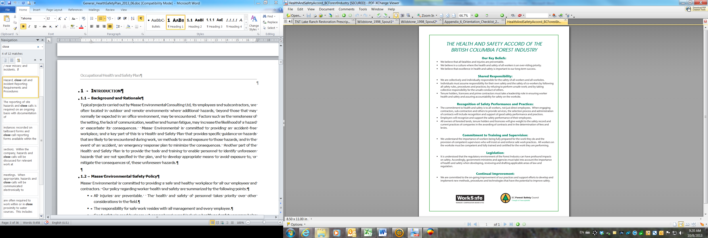

--- 
title: "Occupational Health and Safety Plan"
author: |
 |
 | Prepared for

 |
 |
 | Prepared by
 | Al Irvine, B.Sc., R.P.Bio.
 | New Graph Environment Ltd.

date: |
 |
 | Version 0.0.2 `r format(Sys.Date(), "%Y-%m-%d")`
toc-title: Table of Contents
site: bookdown::bookdown_site
output: 
  bookdown::gitbook:
          includes:
            in_header: header.html
nocite: |

documentclass: book
bibliography: [book.bib, packages.bib, references.bib]
biblio-style: apalike
link-citations: no
github-repo: rstudio/bookdown-demo
description: "My Description."


---

```{r switch-gitbook-html, echo=FALSE}
gitbook_on <- TRUE
# gitbook_on <- FALSE  ##we just need turn  this on and off to switch between gitbook and pdf via paged.js

```

```{r setup, echo=identical(gitbook_on, TRUE), include = TRUE}
knitr::opts_chunk$set(echo=identical(gitbook_on, TRUE), message=FALSE, warning=FALSE, dpi=60, out.width = "100%")
# knitr::knit_hooks$set(webgl = hook_webgl)
options(scipen=999)
options(knitr.kable.NA = '--') #'--'
options(knitr.kable.NAN = '--')
```

```{r settings-gitbook, eval= gitbook_on}
photo_width <- "100%"
font_set <- 11

```

```{r settings-paged-html, eval= identical(gitbook_on, FALSE)}
photo_width <- "80%"
font_set <- 9
```


```{r}
source('scripts/packages.R')
source('scripts/functions.R')

```


```{r include=FALSE}
# automatically create a bib database for R packages
knitr::write_bib(c(
  .packages(), 'bookdown', 'knitr', 'rmarkdown'
), 'packages.bib')
```

# Acknowledgement {.front-matter .unnumbered}


Modern civilization has a long journey ahead to acknowledge and address the historic and ongoing impacts of colonialism that have resulted in harm to the cultures and livelihoods living interconnected with our ecosystems for many thousands of years. 


```{js, logo-header, echo = FALSE, eval= T}
title=document.getElementById('header');
title.innerHTML = '' + title.innerHTML
```


<!--chapter:end:index.Rmd-->

# Safety Policy 
 
At New Graph Environment we believe that all injuries are preventable 
and that safety is the responsibility of everyone. We believe that 
getting hurt at work is not acceptable and that by building a culture of 
safety we: 
 
-   will look ahead to identify hazards, 
 
-   will document safety procedures and ensure that our management, 
    staff and contractors are familiar with them and understand why we 
    have them, 
 
-   will strive for continuous improvement to ensure that we learn from 
    the past and look to the future to facilitate the safest working 
    environment possible for ourselves, our contractors, our clients and 
    the public. 
 
## Forest Safety Accord 

```{r}
# this is a test

```


## Corrective Action Log 
 
These corrective actions are to be completed by the person indicated, 
within the time frame allotted. If more time is required, or there are 
difficulties encountered, please contact Allan Irvine for assistance. 
 
  ------------------------------------------------------------------------- 
  **Identified Necessary  **Required Corrective   **Person        **By 
  Improvement, Issue or   Action**                Responsible**   When** 
  Problem**                                                        
  ----------------------- ----------------------- --------------- --------- 
                                                                   
 
                                                                   
 
                                                                   
 
                                                                   
  ------------------------------------------------------------------------- 
 
## Safety Team Members 
 
As a small company all management and staff are considered safety team 
members and expected to integral to the safety program. Feedback is 
encouraged as continual improvement is a paramount goal. 
 
## Job Roles and Responsibilities 
 
### Right to refuse work and report unsafe conditions {#right-to-refuse-work-and-report-unsafe-conditions .Style1} 
 
If you feel the work as planned is unsafe, refuse to do it! Let's 
identify the hazards and mitigate for them or we will not do the work. 
This is work and it is not worth it to risk life and limb. 
 
## COVID 19 Prevention and Risks 
 
We have developed a COVID-19 Safety Plan that outlines the policies, 
guidelines, and procedures to reduce the risk of COVID-19 transmission. 
 
All staff, contractors, volunteers, and participants must complete a 
self-assessment (<https://bc.thrive.health/covid19/en>) before starting 
work each day. If they are experiencing any symptoms related to COVID-19 
they must halt all involvement or participation, notify the project 
supervisor, and get officially tested. 
 
The virus that causes COVID-19 spreads in several ways, including 
through droplets when a person coughs or sneezes, or from touching a 
contaminated surface before touching the face. Planning to COVID-19 is a 
moving target and should be a continuous effort. Planning is outlined by 
WCB 
(<https://www.worksafebc.com/en/about-us/covid-19-updates/covid-19-returning-safe-operation>). 
Detailed procedures are included in the safe work procedures in the 
Appendices of this document and were developed by progressing through 
the following steps: 
 
1.  Assess the risk at your workplace to identify places where the risk 
    of transmission is introduced 
 
    a.  What job tasks or processes require workers to come into close 
        proximity with one another or members of the public? 
 
    b.  What tools, machinery, and equipment do people come into contact 
        with in the course of their work? 
 
    c.  What surfaces are touched often, such as doorknobs, light 
        switches, equipment, and shared tools? 
 
2.  Implement measures to reduce the risk 
 
    a.  Maintain a distance of 2 metres (6 feet) between workers and 
        others wherever possible 
 
    b.  create pods of workers who work together exclusively to minimize 
        the risk of broad transmission throughout the workplace 
 
    c.  where physical distance cannot be maintained consider the use of 
        masks. 
 
    d.  Provide adequate hand-washing facilities on site for all workers 
 
    e.  Develop policies around when workers must wash their hands, 
        including upon arriving for work, before and after breaks and 
        before and after handling common tools and equipment. 
 
    f.  Implement a cleaning protocol for all common areas and surfaces, 
        including washrooms, equipment, tools, common tables, desks, 
        light switches, and door handles. Ensure those engaged in 
        cleaning have adequate training and materials. 
 
    g.  Remove any unnecessary tools or equipment that may elevate the 
        risk of transmission. 
 
3.  Develop policies to manage the workplace 
 
    a.  Anyone who has had [symptoms of 
        COVID-19](http://www.bccdc.ca/health-info/diseases-conditions/covid-19/about-covid-19/symptoms) 
        in the last 10 days must self-isolate at home. 
 
    b.  Anyone under the direction of the provincial health officer to 
        self-isolate must follow those instructions 
 
    c.  When workers or contractors are feeling ill at work they should 
        immediately let their supervisor know and go home. If symptoms 
        align with those of COVID-19 they should be tested and 
        self-isolate until they are symptom free and have a negative 
        test result. 
 
## Required safety meetings 
 
### New Worker Orientations  {#new-worker-orientations .Style1} 
 
New workers are a high risk for injuries. They need to know the safety 
policies and procedures and demonstrate that they understand how to 
protect themselves and others. All employees and dependent contractors 
operating under your company's safety plan must review the New Graph 
health and safety policies and safe work procedures on their first day 
before they start work or when returning to work after an absence of 
longer than 6 weeks. Template to be filled out is attached as Appendix 
1. 
 
### Tailboards (Site and Worker Assessment / Equipment and Vehicle Inspection / Emergency Contact List) {#tailboards-site-and-worker-assessment-equipment-and-vehicle-inspection-emergency-contact-list .Style1} 
 
Tailboard meetings are a way to reset at the start of new work tasks to  put safety first as the top priority at all places of work. Our tailboard template is unique in that it contains places for documentation of numerous safety policy actions in one place. Tailboards include references to field safety plans and contain:

  * site assessments
  * Worker Assessments
  * Equipment and Vehicle Inspections 
  * Emergency Contact List
  * Hazard inspections
  * Add more here
  
They are included in this plan as **Appendix 2** 
 
## First Aid equipment and procedures 

A level 1 kit is kept under the seat of each work vehicle and our OHSP in also kept in the truck. The kit should be inspected for contents to see that it is complete. Below is an itemized list of what should be in the kit:


    * Find a refrence online to what is in this kit and put here.
 
### Worksite First Aid Requirements {#worksite-first-aid-requirements .Style1} 
 
To determine an adequate and appropriate level of first aid coverage, 
the first step is a first aid assessment. This doesn\'t need to be 
complicated. But it does call for a full review of your workplace. The 
assessment will help you determine the minimum level of first aid needed 
in your workplace. First aid levels are outlined in the [OHS Regulation 
Schedule 3-A: Minimum Levels of First 
Aid](https://www.worksafebc.com/en/law-policy/occupational-health-safety/searchable-ohs-regulation/ohs-regulation/part-03-rights-and-responsibilities#Schedule3A). 
 
Below are the steps for a first aid assessment. Tables of scenarios 
based on the number of people working and the assessed hazard rating are 
included in Appendix 4. 
 
-   Identify the number of workplaces. 
 
-   Identify your workplace hazard rating. 
 
-   Consider the surface travel time to a hospital. 
 
-   Determine the number of workers on a shift. 
 
-   Determine the required first aid services for your workplace. 
 
-   Review your assessment. 
 


<!--chapter:end:0110-intro.Rmd-->

# Plans and Assessments

## Field Safety Plans {#field-safety-plans .Style1} 
 
### Check-in procedures and field communications  
 
## Hazard / close-call / incident reporting requirements and procedures {#hazard-close-call-incident-reporting-requirements-and-procedures .Style1} 

Close calls are opportunities to prevent incidents in the future.  For this reason we have policies in place that we document them and review them. Close-call reporting templates are provided as an appendix and are required when:

    * there is a near miss for an injury
    * equipment is almost damaged
    
 
## Emergency Response Plan (ERP) and procedures {#emergency-response-plan-erp-and-procedures .Style1} 


###  Vehicle and Machinery Inspections  

If your wheel falls off your truck you can get hurt or hurt someone else. 
This is an example of why we inspect our equipment, record issues and act to ensure everything is in working order. Included in our tailboard templat
 
###  Site and Worker Assessments  

As an employer, we should conduct a systematic risk assessment to help us identify the hazards that exist in your workplace, and how they may put your workers at risk. To determine if we've done enough to protect our workers, we use a rating system as part of your risk assessment.  

<br>


**Insert screenshot of rating system here**
 
##  Contractor Selection Policy 
 
At New Graph we are responsible to ensure that the contractors we hire 
to complete and assist on projects are compliant with the workers 
compensation act and have a record that illustrates they have a culture 
of safety. For forestry related work that contractors need to be Safe 
Certified companies. We have a checklist that we require our contractors 
to complete to ensure that they meet our requirements. Our policy is to 
always get a clearance letter before and after we receive services from 
a contractor to confirm whether they registered with worksafe BC and 
paying premiums. The contractor selection and safety checklist is 
included as Appendix XXXXXXXXXXXXXX. 
 
Of note, contractors are considered our workers if they do not operate 
as an independent business and are either not eligible for WorkSafeBC 
coverage or decline to purchase WorkSafeBC's optional coverage. Below 
are examples of situations where a contractor would likely be our 
worker: 
 
-   The contractor supplies only labour 
 
-   The contractor supplies labour and minor materials 
 
-   The contractor supplies labour and a piece of major equipment but is 
    not registered with WorkSafeBC 
 
## Personal Protective Equipment (PPE) policy 
 
All employees will be provided the required PPE when they are hired, and 
instructed on its proper use and care. Employees are responsible for 
keeping PPE in good working condition and notifying their supervisor if 
any PPE no longer meets safe standards. 
 
All PPE must meet regulatory and Canadian Standards Association 
standards. 
 
The following provides a *guideline* to the requirements and use of PPE. 
A full listing of requirements can be found in the Occupational Health 
and Safety Regulation at 
<https://www.worksafebc.com/en/law-policy/occupational-health-safety/searchable-ohs-regulation/ohs-regulation/part-08-personal-protective-clothing-and-equipment> 
 
+-------------+--------------------+----------------------------------+ 
| **PPE**     | **Requirements**   | **Used in these situations**     | 
+=============+====================+==================================+ 
| High        | -   The apparel    | -   When worker is outside of    | 
| -visibility |     must be a      |     the vehicle.                 | 
| clothing    |     color that     |                                  | 
| (vest)      |     contrasts with | -   On all construction sites    | 
|             |     the            |                                  | 
|             |     environment.   |                                  | 
+-------------+--------------------+----------------------------------+ 
| Limb and    | -   Must be free   | -   When the worker is exposed   | 
| body        |     of holes and,  |     to a substance or condition  | 
| protection  |     in the case of |     that is likely to puncture,  | 
|             |     hand           |     abrade or affect the skin -- | 
|             |     protection,    |     or be absorbed through the   | 
|             |     made of a      |     skin.                        | 
|             |     material that  |                                  | 
|             |     provides a     |                                  | 
|             |     good grip.     |                                  | 
+-------------+--------------------+----------------------------------+ 
| Warm dry    |                    | -   All field work situations.   | 
| clothing    |                    |     Particularly in night work   | 
|             |                    |     and during seasons of        | 
|             |                    |     typically variable and cold  | 
|             |                    |     wet weather.                 | 
+-------------+--------------------+----------------------------------+ 
| Wading Belt |                    | -   Must be worn around waste    | 
|             |                    |     snugly in conjunction with   | 
|             |                    |     waders to ensure that waders | 
|             |                    |     do not fill with water in    | 
|             |                    |     the event of a fall in the   | 
|             |                    |     water.                       | 
+-------------+--------------------+----------------------------------+ 
| Wading      | -   Soft rubber or | -   When stream work is          | 
| Boots       |     felt sole      |     required.                    | 
|             |     footwear       |                                  | 
|             |     specifically   |                                  | 
|             |     designed for   |                                  | 
|             |     stream work    |                                  | 
+-------------+--------------------+----------------------------------+ 
| Polarized   |                    | -   Must be worn while working   | 
| glasses     |                    |     in and around water          | 
+-------------+--------------------+----------------------------------+ 
| Throw bag   | -   Must be 15     | -   When worker is working in/   | 
| and         |     meters of      |     or around swift water        | 
| releasable  |     line.          |                                  | 
| safety rope |                    |                                  | 
+-------------+--------------------+----------------------------------+ 
| Personal    | -   Must be        | -   When worker is working in/   | 
| Floatation  |     Canadian       |     or around deep open water    | 
| Device      |     General        |                                  | 
|             |     Standards      |                                  | 
|             |     Approved       |                                  | 
|             |                    |                                  | 
|             | -   Must be stored |                                  | 
|             |     in a dry area. |                                  | 
|             |                    |                                  | 
|             | -   Avoid exposure |                                  | 
|             |     to sunlight.   |                                  | 
+-------------+--------------------+----------------------------------+ 
| Hard hats   | -                  | -   Must be worn in any work     | 
|             |   High-visibility, |     area where there is a danger | 
|             |     hardhat.       |     of head injury from falling, | 
|             |                    |     flying or thrown objects, or | 
|             | -   Cleaned        |     other harmful contacts.      | 
|             |     regularly and  |                                  | 
|             |     stored away    | -   Must be worn on all          | 
|             |     from grease    |     construction based job       | 
|             |     and tools.     |     sites.                       | 
+-------------+--------------------+----------------------------------+ 
| Helmets     | -   Must be DOT    | -   Must be worn when operating  | 
|             |     approved       |     ATV/ snowmobile.             | 
|             |                    |                                  | 
|             | -   Must be free   |                                  | 
|             |     of cracks,     |                                  | 
|             |     dents or any   |                                  | 
|             |     other damage.  |                                  | 
+-------------+--------------------+----------------------------------+ 
| Eye and     | -   Safety eyewear | -   Safety eyewear must be worn  | 
| face        |     must fit       |     when working in conditions   | 
| protection  |     properly and   |     that are likely to injure or | 
|             |     include side   |     irritate the eyes.           | 
|             |     shields when   |                                  | 
|             |     necessary for  | -   Face protectors must also be | 
|             |     worker safety. |     used if there is a risk of   | 
|             |                    |     face injury such as when     | 
|             |                    |     operating a chain or brush   | 
|             |                    |     saw.                         | 
+-------------+--------------------+----------------------------------+ 
| Safety      | -   Must be of a   | -   Appropriate footwear must    | 
| footwear    |     design,        |     consider the following       | 
|             |     construction   |     factors: slipping, uneven    | 
|             |     and material   |     terrain, abrasion, ankle     | 
|             |     appropriate to |     protection and foot support, | 
|             |     the protection |     crushing potential,          | 
|             |     required for   |     temperature extremes,        | 
|             |     the work       |     corrosive substances,        | 
|             |     environment.   |     puncture hazards, electrical | 
|             |                    |     shock, and any other         | 
|             |                    |     recognizable hazard.         | 
|             |                    |                                  | 
|             |                    | -   Toe and metatarsal           | 
|             |                    |     protection, puncture         | 
|             |                    |     resistance, and/or           | 
|             |                    |     dielectric protection must   | 
|             |                    |     be used where appropriate.   | 
|             |                    |                                  | 
|             |                    | -   Caulked or other equally     | 
|             |                    |     effective footwear must be   | 
|             |                    |     worn by workers who are      | 
|             |                    |     required to walk on logs,    | 
|             |                    |     piles, pilings or other      | 
|             |                    |     round timbers.               | 
+-------------+--------------------+----------------------------------+ 
| Hearing     | -   WorkSafeBC's   | -   If those levels cannot be    | 
| protection  |     regulations    |     practicably met, the         | 
|             |     regarding      |     employer must:               | 
|             |     noise exposure |                                  | 
|             |     are:           |     -   Reduce levels as low as  | 
|             |                    |         > possible               | 
|             |     -   85dBA Lex  |                                  | 
|             |         > daily    |     -   Provide to workers       | 
|             |         > noise    |         > hearing protection     | 
|             |         > exposure |         > that meets CSA         | 
|             |         > level    |         > standards, and ensure  | 
|             |                    |         > it is worn effectively | 
|             |     -   140 DBC    |         > in noise hazard areas  | 
|             |         > peak     |                                  | 
|             |         > sound    |                                  | 
|             |         > level    |                                  | 
+-------------+--------------------+----------------------------------+ 
| Bear Spray  | -   Always worn in | -   Must be readily available in | 
| / Bangers   |     remote         |     case of any bear sighting.   | 
|             |     locations      |                                  | 
|             |                    | -   Must be carried for all      | 
|             | -   Inspected      |     remote worksites or          | 
|             |     regularly and  |     worksites where there is     | 
|             |     stored in a    |     potential bear activity.     | 
|             |     safe, dry      |                                  | 
|             |     place.         | -   Ensure equipment has current | 
|             |                    |     use by date attached.        | 
+-------------+--------------------+----------------------------------+ 
 
## WHMIS orientation and location of the Material Safety Data Sheets (MSDS) 
 
## Records of Training 
 
## Progressive discipline policy 
 
Actions and behaviors that create or facilitate unsafe working 
environments and elevate the risk of injury to company representatives, 
contractors and the public are unacceptable. To ensure that these 
actions and behaviors do not persist once identified, the following 
progressive discipline policy has been implemented. 
 
1.  Verbal Warning 
 
2.  Documented Warning 
 
3.  Letter of Reprimand 
 
4.  Discharge 
 

<!--chapter:end:0200-plans-assessments.Rmd-->

# Random Forms
 
## New Worker Orientation 

All employees and dependent contractors operating under your company's 
safety plan must review the following general areas **on their first day 
before they start work or when returning to work after an absence of 
longer than 6 weeks**. 
 

## Tailboard Template 


 


<!--chapter:end:0300-forms.Rmd-->

# Safe Work Procedures 
 
## Driving {#driving .Style1} 
 
### PROCEDURES AND PRACTICES: 
 
-   Conduct a "pre-trip" vehicle check. Use a Vehicle Pre-trip 
    Inspection and Mileage Log to track activity. 
 
-   Report deficiencies and do not use if equipment is in unsafe 
    condition. 
 
-   Make notes of required maintenance in the mileage logbook when it is 
    required and include "checking the logbook for required repairs" at 
    the time of each inspection. 
 
-   Drive defensively at all times. 
 
-   Ensure all vehicle occupants are wearing seatbelts. You are 
    responsible for your passengers. 
 
-   Do not exceed posted speed limits. 
 
-   On resource roads do not exceed 80kph or posted speed limits. 
 
-   Drive safely and drive to the existing road conditions. Lower speed 
    as required. Be aware of: 
 
    -   Visibility reduced by dust, fog, rain and snow; 
 
    -   Narrow roads with over width vehicles; 
 
    -   Steep favorable and adverse gradients; 
 
    -   Slippery and variable road surface conditions due to loose 
        gravel, snow, ice or mud; 
 
    -   Other users. 
 
-   Use vehicle for intended use only (purpose and weight limitations). 
 
-   Drive with vehicle lights on at all times. 
 
-   Secure all heavy or sharp objects in the cab of the vehicle. 
 
-   Respect that loaded logging trucks have the right of way on single 
    lane roads. 
 
-   Do not tailgate other vehicles. 
 
-   Pass trucks or equipment only after you receive a clearly visible 
    and/or audible signal from the operator. 
 
-   Never chase a runaway vehicle. 
 
-   Stay on your side of the road. 
 
    **COVID 19 (COVID)** 
 
    -   [Self-assess daily for COVID 
        symptoms](https://bc.thrive.health/covid19/en) and self-isolate 
        and test if you have symptoms. 
 
    -   When possible, travel in separate vehicles. When a crew is 
        required to travel together, sit in seats as far from eachother 
        as possible, wear masks and when possible leave the windows open 
        for good ventilation. 
 
    -   All vehicles need to have paper towel, min 70% alcohol hand 
        sanitizer and non-medical grade masks. Ensure this is present 
        before leaving. 
 
    -   When getting in vehicle wipe down all initial touch points with 
        min 70% alcohol and paper towel (ex. Vehicle door, radio, 
        steering wheel, shifter, seat belt). Sanitize all surfaces of 
        both hands. 
 
    -   After opening vehicle door at all stops and worksites use hand 
        sanitizer on surfaces of both hands. Put on non-medical mask if 
        entering building (ex. Gas station, restaurants) or working with 
        others where you cannot keep min 2m distance. Upon exiting 
        vehicle close door with elbow. 
 
### RADIO USE: 
 
-   Complete radio check and ensure correct frequency prior to entering 
    radio controlled area. 
 
-   Do not drive by the radio. Expect oncoming traffic at all times. 
 
-   Call your position according to the local radio protocol and 
    signage. 
 
-   Notify other radio equipped vehicles of oncoming non-radio equipped 
    traffic. 
 
-   Do not use road radio channels for conversations, use only for road 
    traffic protocols. 
 
-   Other than traffic control, pull over and safely park when talking 
    on the radio/cell phone for an extended period of time. 
 
### PARKING: 
 
-   Park clear of traffic, away from active areas in pullouts or extra 
    wide straight sections of road. 
 
-   Park facing the direction of exit with access for service/towing 
    activities. 
 
-   Ensure the parking brake is on and the transmission is in 1st gear 
    or park. 
 
-   On steep grades, use wheel chocks and always turn the wheels towards 
    the nearest ditch. 
 
-   Never park on a curve especially on the outside curve of a road. 
 
-   When turning around, back into the cut bank of the road and not 
    towards the outside bank. 
 
-   Use flares where required. 
 
## All-terrain vehicles {#all-terrain-vehicles .Style1} 
 
{width="7.958500656167979in" 
height="6.036744313210849in"} 
 
{width="8.521936789151356in" 
height="6.4813320209973755in"} 
 
## Electrofishing {#electrofishing .Style1} 
 
### Preparatory Procedures  
 
1.  A crew leader must be designated for all backpack electrofishing 
    activities. 
 
2.  It is the crew leader's responsibility to ensure that all equipment 
    is in "safe working order". 
 
3.  An emergency response plan must be prepared and reviewed with all 
    crew members. 
 
4.  The crew leader must ensure all crew members have received 
    instruction in the fundamentals of electrofishing safety. 
 
5.  The crew leader and at least one additional crew member must have 
    up-to-date CPR and First Aid training. 
 
6.  Each electrofishing site must be visually inspected for hazards such 
    as deep holes, submerged logs, etc. before commencing electrofishing 
    operations. 
 
7.  In order to aid in identifying underwater hazards, all crew members 
    must be equipped with polarized sunglasses. Glasses also protect 
    against eye injury caused by sticks and branches. Wide brimmed hats 
    or peaked caps are also beneficial in increasing the effectiveness 
    of polarized glasses. 
 
8.  All crew members must be equipped with long armed gloves that are 
    non-conductive, waterproof and inspected to be free of leaks. Gloves 
    must be worn at all times during electrofishing operations. 
 
9.  All crew members must be equipped with chest waders that are 
    non-conductive, waterproof and inspected to be free of leaks. Chest 
    waders must be worn at all times during electrofishing operations by 
    team members entering the water. Wading belts are to be worn at all 
    times. 
 
10. All crew members must agree on a system of communication during 
    electrofishing operations. 
 
11. Backpack electrofishing units must be turned off and the battery 
    disconnected before making any connections or part replacements. 
    Start-up Procedures 
 
12. All crew members must be notified and acknowledge their preparedness 
    prior to the commencement of electrofishing operations. The unit 
    operator must make sure that personnel are clear of the anode before 
    turning on the power. Hand signals are a useful way of conveying 
    these messages. 
 
13. Check operation of all switches and gauges. This should include high 
    voltage check, anode switch, power switch and mercury tilt switch, 
    audible tone generator and light. Set controls to appropriate 
    levels. The minimum voltage possible to obtain the desired results 
    should be used to avoid excessive harm to the biota and to minimize 
    the effects of accidental shock. 
 
### Operational Procedures  
 
14. Operate slowly and carefully. Footing in most streams is poor and 
    most falls occur when crew members are hurrying. Operations should 
    cease when fatigue sets in. 
 
15. Team members must not place their hand(s) into the water when the 
    power is turned on. 
 
16. Electrofishing units must be shut off prior to entering or leaving 
    the water and the battery terminals disconnected (or generator shut 
    off) when not in use or when transporting the unit. 
 
17. Life jackets or Personal Floatation Devices (PFDs) must be worn 
    where the crew leader considers the water is of sufficient depth or 
    velocity for a life jacket or PFD to be effective as protection from 
    risk of drowning. Life jackets and PFDs must be approved by 
    Transport Canada or Canadian Coast Guard. Electrofishing should not 
    be carried out where water depth is greater than waist deep. 
 
18. A crew member must immediately leave the water if wetness is 
    detected in gloves or waders (by leaks, rain or perspiration) and 
    obtain dry equipment before returning. Mild dampness from 
    perspiration or humidity is considered normal. 
 
19. Electrofishing operations must cease during inclement weather. (e.g. 
    periods of any lightning or moderate rain). 
 
**COVID 19** 
 
-   As electrofishing often requires the "fisher" and "netter" to be 
    within 2m of eachother masks are required to be worn by both crew 
    members. 
 
-   Wear disposable gloves when assembling equipment or wipe down all 
    touch points after assembly. 
 

# Boats {#boats .Style1} 
 
# Culvert Assessments and habitat confirmation assessments {#culvert-assessments-and-habitat-confirmation-assessments .Style1} 
 
See driving procedures including radio use and parking. 
 
-   Sometime parking on the shoulder of resource roads is the only 
    practical way to assess a site. When doing so place a traffic cone 
    2m behind the back left wheel to alert oncoming traffic. 
 
-   Wear waders and wading boots or a non-slip rubber boot when working 
    in the stream. Carefully assess your footing and be ready for 
    slippery surfaces. 
 
-   Carry bear spray 
 
-   Always carry personal first aid kit, water, extra clothes, inreach 
    and food (ex. Power bar) in your vest in case of an emergency. 
 
-   High vis field vest should be worn to avoid being mistaken for an 
    animal by hunters. 
 
-   Navigating to sites requires handheld devices which should either be 
    used by a non-driving crew member or mounted on the windshield where 
    they can be viewed without distracting the driver. 
 
-   Touching base with the call in person throughout the day is 
    essential so that your last known location is known and to minimize 
    the potential for false alarms should you not check in on time at 
    the end of the day. Inreaches should be tested between crew members 
    and between crew members and check in people before going in the 
    field. 
 
# Bears {#bears .Style1} 
 
+---------------------+------------------------------------------------+ 
| **Situation**       | **Recommended actions**                        | 
+=====================+================================================+ 
| Bear does not know  | Move away undetected.  Go back the way you     | 
| you are there       | came or take large detour around. If you must  | 
|                     | go ahead do so slowly and cautiously. DO NOT   | 
|                     | RUN                                            | 
|                     |                                                | 
|                     | Keep your eye on the bear.                     | 
|                     |                                                | 
|                     | Watch for changes in behavior.                 | 
|                     |                                                | 
|                     | Be careful not to crowd or surprise bear       | 
|                     | (especially Grizzlies).  Do not shout if it is | 
|                     | unaware of your presence.                      | 
+---------------------+------------------------------------------------+ 
| Bear becomes aware  | Calmly and from as far away as possible        | 
| of you              | identify yourself as human.                    | 
|                     |                                                | 
|                     | Talk to the bear in a low, respectful voice.   | 
|                     |                                                | 
|                     | Wave your arms slowly.                         | 
|                     |                                                | 
|                     | Increase the distance between you and the      | 
|                     | bear.                                          | 
|                     |                                                | 
|                     | If possible, move upwind to give the bear your | 
|                     | scent.                                         | 
|                     |                                                | 
|                     | When bear is aware and unconcerned take the    | 
|                     | opportunity to leave. Do not run.              | 
+---------------------+------------------------------------------------+ 
| If you hear bear    | Be extremely cautious and leave the area the   | 
| vocalizations or    | way you came.                                  | 
| see young bears in  |                                                | 
| area                |                                                | 
+---------------------+------------------------------------------------+ 
| If bear approaches  | Stop, stay calm, and assess the situation: is  | 
| you                 | bear acting defensively (grunting, or another  | 
|                     | way?                                           | 
|                     |                                                | 
|                     | Don't run.                                     | 
|                     |                                                | 
|                     | Group together if possible.  Prepare deterrent | 
|                     | (mace).                                        | 
|                     |                                                | 
|                     | Determine if bear is **defensive or            | 
|                     | aggressive.**                                  | 
+---------------------+------------------------------------------------+ 
| Bear approaching in | **Defensive bears are threatened or may be     | 
| a defensive         | protecting food. They show stressed behaviour  | 
| (stressed) manner   | such as rapid huffing, salivating, roaring,    | 
|                     | paw slapping, guttural noises, open mouthed    | 
|                     | jawing and charging.**                         | 
|                     |                                                | 
|                     | When bear approaches or charges stand your     | 
|                     | ground (physical contact is rare). Most        | 
|                     | charges stop short.                            | 
|                     |                                                | 
|                     | Appear non-threatening.                        | 
|                     |                                                | 
|                     | Talk to bear in calm voice and let it know you | 
|                     | mean it no harm.                               | 
|                     |                                                | 
|                     | Don't shout or throw things acting             | 
|                     | defensively.  Try to increase distance between | 
|                     | you and the bear (keep your eye on it).  Do    | 
|                     | not run.                                       | 
|                     |                                                | 
|                     | Use deterrent only as last defense.            | 
+---------------------+------------------------------------------------+ 
| In the case of a    | If bear physically contacts you in a defensive | 
| defensive attack    | attack play dead: fall on ground on your       | 
|                     | front, protect your neck.  If rolled over      | 
|                     | continue to roll over to face.  Stay on ground | 
|                     | till bear leaves.  If attach is prolonged it   | 
|                     | is no longer defensive.                        | 
+---------------------+------------------------------------------------+ 
| Bear approaching in | **Non defensive bears show little stress. They | 
| **non-defensive**   | look interested in you and intent on           | 
| manner              | approaching you. Watch towards you confidently | 
|                     | looking towards you intermittently. They seem  | 
|                     | intent on attack.**                            | 
|                     |                                                | 
|                     | If approached move away from bears path or     | 
|                     | trail.                                         | 
|                     |                                                | 
|                     | If bear is intent on you stand your ground.    | 
|                     | **Your response needs to be assertive.**       | 
|                     |                                                | 
|                     | Act aggressively: shout at bear, stare it in   | 
|                     | the eye, stamp feet, stand on stump or log,    | 
|                     | threaten bear with stick or log.               | 
|                     |                                                | 
|                     | If attacked use deterrent, fight with any      | 
|                     | weapon available with all your strength.       | 
|                     | Focus attack on bear's face.                   | 
+---------------------+------------------------------------------------+ 
 
#  
 
Appendix 4 
 
First Aid Requirements 
 
**Table 1**: This table applies to a workplace that an employer 
determines under section 3.16 (2) (b) of the Regulation creates a low 
risk of injury and that is more than 20 minutes surface travel time away 
from a hospital. 
 
+----+-------------+-----------------+-------------------+------------+ 
| ** | **Column 1\ | **Column 2\     | **Column 3\       | **Column   | 
| It | Number of   | Supplies,       | Level of first    | 4\         | 
| em | workers per | equipment, and  | aid certificate   | Transp     | 
| ** | shift**     | facility**      | for attendant**   | ortation** | 
+====+=============+=================+===================+============+ 
| 1  | 1           | Personal first  |                   |            | 
|    |             | aid kit         |                   |            | 
+----+-------------+-----------------+-------------------+------------+ 
| 2  | 2-5         | Basic first aid |                   |            | 
|    |             | kit             |                   |            | 
+----+-------------+-----------------+-------------------+------------+ 
| 3  | 6-30        | Level 1 first   | Level 1           |            | 
|    |             | aid kit         | certificate       |            | 
+----+-------------+-----------------+-------------------+------------+ 
| 4  | 31-50       | Level 1 first   | Level 1           |            | 
|    |             | aid kit         | certificate with  |            | 
|    |             |                 | Transportation    |            | 
|    |             | -   ETV         | Endorsement       |            | 
|    |             |     equipment   |                   |            | 
+----+-------------+-----------------+-------------------+------------+ 
| 5  | 51-75       | Level 3 first   | Level 3           |            | 
|    |             | aid kit         | certificate       |            | 
|    |             |                 |                   |            | 
|    |             | -   Dressing    |                   |            | 
|    |             |     station     |                   |            | 
|    |             |                 |                   |            | 
|    |             | ETV equipment   |                   |            | 
+----+-------------+-----------------+-------------------+------------+ 
| 6  | 76 or more  | Level 3 first   | Level 3           | ETV        | 
|    |             | aid kit         | certificate       |            | 
|    |             |                 |                   |            | 
|    |             | -   First aid   |                   |            | 
|    |             |     room        |                   |            | 
|    |             |                 |                   |            | 
|    |             | ETV equipment   |                   |            | 
+----+-------------+-----------------+-------------------+------------+ 
 
**Table 2**: This table applies to a workplace that an employer 
determines under section 3.16 (2) (b) of the Regulation creates a low 
risk of injury and that is 20 minutes or less surface travel time away 
from a hospital. 
 
+----+-------------+-----------------+-------------------+------------+ 
| ** | **Column 1\ | **Column 2\     | **Column 3\       | **Column   | 
| It | Number of   | Supplies,       | Level of first    | 4\         | 
| em | workers per | equipment, and  | aid certificate   | Transp     | 
| ** | shift**     | facility**      | for attendant**   | ortation** | 
+====+=============+=================+===================+============+ 
| 1  | 1           |                 |                   |            | 
+----+-------------+-----------------+-------------------+------------+ 
| 2  | 2-10        | Basic first aid |                   |            | 
|    |             | kit             |                   |            | 
+----+-------------+-----------------+-------------------+------------+ 
| 3  | 11-50       | Level 1 first   | Level 1           |            | 
|    |             | aid kit         | certificate       |            | 
+----+-------------+-----------------+-------------------+------------+ 
| 4  | 51-100      | Level 2 first   | \*Level 2         |            | 
|    |             | aid kit         | certificate       |            | 
|    |             |                 |                   |            | 
|    |             | -   Dressing    |                   |            | 
|    |             |     station     |                   |            | 
+----+-------------+-----------------+-------------------+------------+ 
| 5  | 101 or more | Level 2 first   | \*Level 2         |            | 
|    |             | aid kit         | certificate       |            | 
|    |             |                 |                   |            | 
|    |             | -   First aid   |                   |            | 
|    |             |     room        |                   |            | 
+----+-------------+-----------------+-------------------+------------+ 
 
**Table 3**: This table applies to a workplace that an employer 
determines under section 3.16 (2) (b) of the Regulation creates a 
moderate risk of injury and that is more than 20 minutes surface travel 
time away from a hospital. 
 
+----+-------------+-----------------+-------------------+------------+ 
| ** | **Column 1\ | **Column 2\     | **Column 3\       | **Column   | 
| It | Number of   | Supplies,       | Level of first    | 4\         | 
| em | workers per | equipment, and  | aid certificate   | Transp     | 
| ** | shift**     | facility**      | for attendant**   | ortation** | 
+====+=============+=================+===================+============+ 
| 1  | 1           | Personal first  |                   |            | 
|    |             | aid kit         |                   |            | 
+----+-------------+-----------------+-------------------+------------+ 
| 2  | 2-5         | Level 1 first   | Level 1           |            | 
|    |             | aid kit         | certificate       |            | 
+----+-------------+-----------------+-------------------+------------+ 
| 3  | 6-15        | Level 1 first   | Level 1           |            | 
|    |             | aid kit         | certificate with  |            | 
|    |             |                 | Transportation    |            | 
|    |             | -   ETV         | Endorsement       |            | 
|    |             |     equipment   |                   |            | 
+----+-------------+-----------------+-------------------+------------+ 
| 4  | 16-50       | Level 3 first   | Level 3           |  ETV       | 
|    |             | aid kit         | certificate       |            | 
|    |             |                 |                   |            | 
|    |             | -   Dressing    |                   |            | 
|    |             |     station     |                   |            | 
|    |             |                 |                   |            | 
|    |             | -   ETV         |                   |            | 
|    |             |     equipment   |                   |            | 
+----+-------------+-----------------+-------------------+------------+ 
| 5  | 51-100      | Level 3 first   | Level 3           |  ETV       | 
|    |             | aid kit         | certificate       |            | 
|    |             |                 |                   |            | 
|    |             | -   First aid   |                   |            | 
|    |             |     room        |                   |            | 
|    |             |                 |                   |            | 
|    |             | -   ETV         |                   |            | 
|    |             |     equipment   |                   |            | 
+----+-------------+-----------------+-------------------+------------+ 
| 6  | 101-300     | Level 3 first   | Level 3           | Industrial | 
|    |             | aid kit         | certificate       | ambulance  | 
|    |             |                 |                   |            | 
|    |             | -   First aid   |                   |            | 
|    |             |     room        |                   |            | 
|    |             |                 |                   |            | 
|    |             | -   Industrial  |                   |            | 
|    |             |     ambulance   |                   |            | 
|    |             |     equipment   |                   |            | 
+----+-------------+-----------------+-------------------+------------+ 
| 7  | 301 or more | Level 3 first   | 2 attendants,     | Industrial | 
|    |             | aid kit         | each with Level 3 | ambulance  | 
|    |             |                 | certificates      |            | 
|    |             | -   First aid   |                   |            | 
|    |             |     room        |                   |            | 
|    |             |                 |                   |            | 
|    |             | -   Industrial  |                   |            | 
|    |             |     ambulance   |                   |            | 
|    |             |     equipment   |                   |            | 
+----+-------------+-----------------+-------------------+------------+ 
 
**Table 4**: This table applies to a workplace that an employer 
determines under section 3.16 (2) (b) of the Regulation creates a 
moderate risk of injury and that is 20 minutes or less surface travel 
time away from a hospital. 
 
+----+-------------+-----------------+-------------------+------------+ 
| ** | **Column 1\ | **Column 2\     | **Column 3\       | **Column   | 
| It | Number of   | Supplies,       | Level of first    | 4\         | 
| em | workers per | equipment, and  | aid certificate   | Transp     | 
| ** | shift**     | facility**      | for attendant**   | ortation** | 
+====+=============+=================+===================+============+ 
| 1  | 1           | Personal first  |                   |            | 
|    |             | aid kit         |                   |            | 
+----+-------------+-----------------+-------------------+------------+ 
| 2  | 2-5         | Basic first aid |                   |            | 
|    |             | kit             |                   |            | 
+----+-------------+-----------------+-------------------+------------+ 
| 3  | 6-25        | Level 1 first   | Level 1           |            | 
|    |             | aid kit         | certificate       |            | 
+----+-------------+-----------------+-------------------+------------+ 
| 4  | 26-75       | Level 2 first   | \*Level 2         |            | 
|    |             | aid kit         | certificate       |            | 
|    |             |                 |                   |            | 
|    |             | -   Dressing    |                   |            | 
|    |             |     station     |                   |            | 
+----+-------------+-----------------+-------------------+------------+ 
| 5  | 76 or more  | Level 2 first   | \*Level 2         |            | 
|    |             | aid kit         | certificate       |            | 
|    |             |                 |                   |            | 
|    |             | -   First aid   |                   |            | 
|    |             |     room        |                   |            | 
+----+-------------+-----------------+-------------------+------------+ 
 
**Table 5**: This table applies to a workplace that an employer 
determines under section 3.16 (2) (b) of the Regulation creates a high 
risk of injury and that is more than 20 minutes surface travel time away 
from a hospital. 
 
+----+-------------+-----------------+-------------------+------------+ 
| ** | **Column 1\ | **Column 2\     | **Column 3\       | **Column   | 
| It | Number of   | Supplies,       | Level of first    | 4\         | 
| em | workers per | equipment, and  | aid certificate   | Transp     | 
| ** | shift**     | facility**      | for attendant**   | ortation** | 
+====+=============+=================+===================+============+ 
| 1  | 1           | Personal first  |                   |            | 
|    |             | aid kit         |                   |            | 
+----+-------------+-----------------+-------------------+------------+ 
| 2  | 2-5         | Level 1 first   | Level 1           |            | 
|    |             | aid kit         | certificate       |            | 
+----+-------------+-----------------+-------------------+------------+ 
| 3  | 6-10        | Level 1 first   | Level 1           |  ETV       | 
|    |             | aid kit         | certificate with  |            | 
|    |             |                 | Transportation    |            | 
|    |             | -   ETV         | Endorsement       |            | 
|    |             |     equipment   |                   |            | 
+----+-------------+-----------------+-------------------+------------+ 
| 4  | 11-30       | Level 3 first   | Level 3           |  ETV       | 
|    |             | aid kit         | certificate       |            | 
|    |             |                 |                   |            | 
|    |             | -   Dressing    |                   |            | 
|    |             |     station     |                   |            | 
+----+-------------+-----------------+-------------------+------------+ 
| 5  | 31-50       | Level 3 first   | Level 3           |  ETV       | 
|    |             | aid kit         | certificate       |            | 
|    |             |                 |                   |            | 
|    |             | -   First aid   |                   |            | 
|    |             |     room        |                   |            | 
|    |             |                 |                   |            | 
|    |             | -   ETV         |                   |            | 
|    |             |     equipment   |                   |            | 
+----+-------------+-----------------+-------------------+------------+ 
| 6  | 51-200      | Level 3 first   | Level 3           | Industrial | 
|    |             | aid kit         | certificate       | ambulance  | 
|    |             |                 |                   |            | 
|    |             | -   First aid   |                   |            | 
|    |             |     room        |                   |            | 
|    |             |                 |                   |            | 
|    |             | -   Industrial  |                   |            | 
|    |             |     ambulance   |                   |            | 
|    |             |     equipment   |                   |            | 
+----+-------------+-----------------+-------------------+------------+ 
| 7  | 201 or more | Level 3 first   | 2 attendants,     | Industrial | 
|    |             | aid kit         | each with Level 3 | ambulance  | 
|    |             |                 | certificates      |            | 
|    |             | -   First aid   |                   |            | 
|    |             |     room        |                   |            | 
|    |             |                 |                   |            | 
|    |             | -   Industrial  |                   |            | 
|    |             |     ambulance   |                   |            | 
|    |             |     equipment   |                   |            | 
+----+-------------+-----------------+-------------------+------------+ 
 
Appendix 5 
 
Contractor Selection and Safety Checklist 
 
Contractor Selection and Safety Checklist 
 
<table> 
<colgroup> 
<col style="width: 19%" /> 
<col style="width: 0%" /> 
<col style="width: 1%" /> 
<col style="width: 3%" /> 
<col style="width: 1%" /> 
<col style="width: 2%" /> 
<col style="width: 5%" /> 
<col style="width: 0%" /> 
<col style="width: 2%" /> 
<col style="width: 7%" /> 
<col style="width: 0%" /> 
<col style="width: 3%" /> 
<col style="width: 1%" /> 
<col style="width: 0%" /> 
<col style="width: 4%" /> 
<col style="width: 4%" /> 
<col style="width: 1%" /> 
<col style="width: 3%" /> 
<col style="width: 1%" /> 
<col style="width: 2%" /> 
<col style="width: 4%" /> 
<col style="width: 0%" /> 
<col style="width: 6%" /> 
<col style="width: 4%" /> 
<col style="width: 2%" /> 
<col style="width: 13%" /> 
<col style="width: 0%" /> 
</colgroup> 
<thead> 
<tr class="header"> 
<th>Contract:</th> 
<th colspan="25"></th> 
<th></th> 
</tr> 
</thead> 
<tbody> 
<tr class="odd"> 
<td>Name of Contractor:</td> 
<td colspan="25"></td> 
<td></td> 
</tr> 
<tr class="even"> 
<td>Address:</td> 
<td colspan="25"></td> 
<td></td> 
</tr> 
<tr class="odd"> 
<td>Phone:</td> 
<td colspan="12"></td> 
<td colspan="3">Fax:</td> 
<td colspan="10"></td> 
<td></td> 
</tr> 
<tr class="even"> 
<td colspan="4">WorkSafeBC Employer ID:</td> 
<td colspan="22"></td> 
<td></td> 
</tr> 
<tr class="odd"> 
<td colspan="12">WorkSafeBC current standing (attach clearance 
letter):</td> 
<td colspan="14"></td> 
<td></td> 
</tr> 
<tr class="even"> 
<td colspan="12">WorkSafeBC assessment rate (industry average or 
lower):</td> 
<td colspan="14"></td> 
<td></td> 
</tr> 
<tr class="odd"> 
<td colspan="14">Description of written WorkSafeBC orders in past 24 
months:</td> 
<td colspan="12"></td> 
<td></td> 
</tr> 
<tr class="even"> 
<td colspan="2">References:</td> 
<td colspan="24"></td> 
<td></td> 
</tr> 
<tr class="odd"> 
<td colspan="2">Previous work history:</td> 
<td colspan="24"></td> 
<td></td> 
</tr> 
<tr class="even"> 
<td colspan="26">Using the previous year’s experience, complete the 
following:</td> 
<td></td> 
</tr> 
<tr class="odd"> 
<td colspan="6">Number of first aid cases:</td> 
<td colspan="5"></td> 
<td colspan="11">Number of recordable incidents:</td> 
<td colspan="3"></td> 
<td></td> 
<td></td> 
</tr> 
<tr class="even"> 
<td colspan="6">Number of lost time cases:</td> 
<td colspan="5"></td> 
<td colspan="11">Number of lost days:</td> 
<td colspan="3"></td> 
<td></td> 
<td></td> 
</tr> 
<tr class="odd"> 
<td colspan="7">Severity Rate (<u># of days lost X 200,000</u>):</td> 
<td colspan="4"></td> 
<td colspan="15"></td> 
<td></td> 
</tr> 
<tr class="even"> 
<td colspan="7"><em>Total hours worked</em></td> 
<td colspan="4"></td> 
<td colspan="15"></td> 
<td></td> 
</tr> 
<tr class="odd"> 
<td colspan="2">Exposure Hours</td> 
<td colspan="24"></td> 
<td></td> 
</tr> 
<tr class="even"> 
<td colspan="15">Medical Incident Rate (MIR= <u># of recordable 
incidents X 200,000</u>):</td> 
<td colspan="4"></td> 
<td colspan="7"></td> 
<td></td> 
</tr> 
<tr class="odd"> 
<td colspan="15"><em>Total hours worked</em></td> 
<td colspan="4"></td> 
<td colspan="7"></td> 
<td></td> 
</tr> 
<tr class="even"> 
<td colspan="2">Exposure Hours</td> 
<td colspan="24"></td> 
<td></td> 
</tr> 
<tr class="odd"> 
<td colspan="8">Number of fatalities in the last five years:</td> 
<td colspan="12"></td> 
<td colspan="6"></td> 
<td></td> 
</tr> 
<tr class="even"> 
<td colspan="10">How often are safety meetings held with employees:</td> 
<td colspan="11"></td> 
<td colspan="5"></td> 
<td></td> 
</tr> 
<tr class="odd"> 
<td colspan="5">Are worksite inspections held:</td> 
<td colspan="4"></td> 
<td></td> 
<td colspan="7">if yes, How often:</td> 
<td colspan="7"></td> 
<td colspan="2"></td> 
<td></td> 
</tr> 
<tr class="even"> 
<td colspan="26"><p><strong>Attach a copy of written health and safety 
program. Included within the program should be a list of key personnel 
and supervisors (including qualifications).</strong></p> 
<p>Other procedures you need to be aware of if you are awarded this 
contract include:</p> 
<p>periodic audits by the company.</p> 
<p>contractors and any subcontractors must review the incident 
investigation &amp; reporting requirements, policies and procedures with 
all their employees at least annually.</p> 
<p>All contractors and sub-contractors must be certified with the BC 
Forest Safety Council.</p> 
<p>contractors must comply with all applicable government regulations 
and legislation.</p> 
<p>contractors must have a process for investigating incidents.</p> 
<p>contractors must provide training to all their employees on the 
hazards associated with the job they are being directed to do.</p> 
<p>contractor safety performance will be monitored for continual 
improvement.</p></td> 
<td></td> 
</tr> 
<tr class="odd"> 
<td colspan="3"><strong>Contractor Signature:</strong></td> 
<td colspan="15"></td> 
<td colspan="5"><strong>Date:</strong></td> 
<td colspan="4"></td> 
</tr> 
</tbody> 
</table> 
 
**Contractor Safety Checklist** 
 
To be completed at the commencement of activities at the start of the 
year and then on a quarterly basis thereafter. 
 
  ------------------------------------------------------------------------------- 
  **Contractor:**                            **Contractor      
                                             Contact:**        
  ----------------- ------------------------ ---------------- ------------------- 
  **Location:**                              **Date:**         
 
  ------------------------------------------------------------------------------- 
 
+----------------------------+-----------+-----+----+----------------+ 
| **Item**                   |           | *   | ** | **Comments**   | 
|                            |           | *Ye | No |                | 
|                            |           | s** | ** |                | 
+============================+===========+=====+====+================+ 
| ***Will a qualified        |           |     |    |                | 
| supervisor who meets the   |           |     |    |                | 
| criteria below be on site  |           |     |    |                | 
| at all times?***           |           |     |    |                | 
|                            |           |     |    |                | 
| ***Qualified               |           |     |    |                | 
| Supervision*** means a     |           |     |    |                | 
| person who instructs,      |           |     |    |                | 
| directs and controls       |           |     |    |                | 
| workers in the performance |           |     |    |                | 
| of their duties and who is |           |     |    |                | 
| knowledgeable of the work, |           |     |    |                | 
| the hazards involved and   |           |     |    |                | 
| the means to control the   |           |     |    |                | 
| hazards, by reason of      |           |     |    |                | 
| education, training,       |           |     |    |                | 
| experience or a            |           |     |    |                | 
| combination thereof.       |           |     |    |                | 
+----------------------------+-----------+-----+----+----------------+ 
| How is your organization   |           |     |    |                | 
| identifying and            |           |     |    |                | 
| communicating hazards in   |           |     |    |                | 
| the workplace?             |           |     |    |                | 
| documentation required     |           |     |    |                | 
+----------------------------+-----------+-----+----+----------------+ 
| What does your             |           |     |    |                | 
| organization pre-work      |           |     |    |                | 
| planning process look like |           |     |    |                | 
| and what does your ongoing |           |     |    |                | 
| block hazard assessment    |           |     |    |                | 
| process look like?         |           |     |    |                | 
| documentation required     |           |     |    |                | 
+----------------------------+-----------+-----+----+----------------+ 
| When do you intend to      |           |     |    |                | 
| start operations in the    |           |     |    |                | 
| following blocks?          |           |     |    |                | 
+----------------------------+-----------+-----+----+----------------+ 
| What does your pre-work    |           |     |    |                | 
| meeting look like, does it |           |     |    |                | 
| include all subs -- are    |           |     |    |                | 
| potential hazards          |           |     |    |                | 
| identified prior to        |           |     |    |                | 
| activities occurring?      |           |     |    |                | 
+----------------------------+-----------+-----+----+----------------+ 
| What does the firm's       |           |     |    |                | 
| orientation process look   |           |     |    |                | 
| like for new workers/      |           |     |    |                | 
| contractors /              |           |     |    |                | 
| subcontractors including   |           |     |    |                | 
| service providers arriving |           |     |    |                | 
| at the worksite?           |           |     |    |                | 
+----------------------------+-----------+-----+----+----------------+ 
| Defined Area Safety        |           |     |    |                | 
| Orientation reviewed with  |           |     |    |                | 
| all contractors /          |           |     |    |                | 
| subcontractors at the      |           |     |    |                | 
| Defined Workplace prior to |           |     |    |                | 
| commencing work            |           |     |    |                | 
| activities.                |           |     |    |                | 
+----------------------------+-----------+-----+----+----------------+ 
| Do all contractors /       |           |     |    |                | 
| subcontractors, in the     |           |     |    |                | 
| workplace provide a list   |           |     |    |                | 
| of their designated        |           |     |    |                | 
| supervisors? documentation |           |     |    |                | 
+----------------------------+-----------+-----+----+----------------+ 
| How does the operation     |           |     |    |                | 
| coordinate the activities  |           |     |    |                | 
| of all permitted persons   |           |     |    |                | 
| including contractors /    |           |     |    |                | 
| subcontractors at the      |           |     |    |                | 
| workplace to ensure the    |           |     |    |                | 
| Health and Safety of all   |           |     |    |                | 
| workers is maintained?     |           |     |    |                | 
+----------------------------+-----------+-----+----+----------------+ 
| What are your procedures   |           |     |    |                | 
| in the workplace to ensure |           |     |    |                | 
| safe access? documentation |           |     |    |                | 
+----------------------------+-----------+-----+----+----------------+ 
| What is the process for    |           |     |    |                | 
| assessing the workplace    |           |     |    |                | 
| first aid needs?           |           |     |    |                | 
| documentation              |           |     |    |                | 
+----------------------------+-----------+-----+----+----------------+ 
| How are you conducting     |           |     |    |                | 
| regular inspections of the |           |     |    |                | 
| Workplace, work methods &  |           |     |    |                | 
| practices, including       |           |     |    |                | 
| worker inspections?        |           |     |    |                | 
+----------------------------+-----------+-----+----+----------------+ 
| OHS site safety plan is in |           |     |    |                | 
| place and available to all |           |     |    |                | 
| persons. contractors and   |           |     |    |                | 
| subcontractors at the      |           |     |    |                | 
| worksite.                  |           |     |    |                | 
+----------------------------+-----------+-----+----+----------------+ 
| What is your safety        |           |     |    |                | 
| meeting process? Are all   |           |     |    |                | 
| persons / contractors /    |           |     |    |                | 
| subcontractors at the      |           |     |    |                | 
| workplace included in the  |           |     |    |                | 
| your OHS program and       |           |     |    |                | 
| safety meetings?           |           |     |    |                | 
+----------------------------+-----------+-----+----+----------------+ 
| Are all safety incidents   |           |     |    |                | 
| reported and investigated? |           |     |    |                | 
+----------------------------+-----------+-----+----+----------------+ 
| What does your hazard      |           |     |    |                | 
| reporting and follow up    |           |     |    |                | 
| process look like?         |           |     |    |                | 
+----------------------------+-----------+-----+----+----------------+ 
| What does your ERP look    |           |     |    |                | 
| like and how was it        |           |     |    |                | 
| communicated when it was   |           |     |    |                | 
| last tested?               |           |     |    |                | 
+----------------------------+-----------+-----+----+----------------+ 
| Do you have safe work      |           |     |    |                | 
| procedures for all         |           |     |    |                | 
| activities being carried   |           |     |    |                | 
| out?                       |           |     |    |                | 
+----------------------------+-----------+-----+----+----------------+ 
|                            |           |     |    |                | 
+----------------------------+-----------+-----+----+----------------+ 
| **Signed off on behalf of  |           |     |    |                | 
| Company:**                 |           |     |    |                | 
+----------------------------+-----------+-----+----+----------------+ 
| **Signed off by the        |           |     |    |                | 
| Contractor:**              |           |     |    |                | 
+----------------------------+-----------+-----+----+----------------+ 
| **Dated:**                 |           |     |    |                | 
+----------------------------+-----------+-----+----+----------------+ 
 
Appendix 5 
 
Contractor Selection and Safety Checklist 
 
Incident / Close Call Reporting Form 
 
  --------------- -------- ---- ------------------------- -- -- ---------------- -- -- -- -- ------------------------- ------------------- 
  Date of                                                       Company:                                                
  Incident:                                                                                                             
 
  Date Reported:                                                Location:                                               
 
  Reported By:                                                  Type of Job:                                            
 
                                                                                                                        
 
  **Describe                                                                                                           **Category** 
  incident /                                                                                                            
  close call\                                                                                                           
  (draw diagram                                                                                                         
  on other side                                                                                                         
  if helpful)**                                                                                                         
 
  Notes:                                                                                                               close call 
 
                                                                                                                       bodily 
                                                                                                                       injury/illness 
 
  Notes:                                                                                                               lost time 
 
                                                                                                                       dangerous goods 
                                                                                                                       spill 
 
  Notes:                                                                                                               fire 
 
                                                                                                                       vehicle incident / 
                                                                                                                       damage 
 
  Notes:                                                                                                               ATV incident / 
                                                                                                                       damage 
 
                                                                                                                       other equipment 
                                                                                                                       damage 
 
  Notes:                                                                                                               other (describe) 
 
                                                                                                                       other (describe) 
 
  Names/contact                                                                                                         
  info of any                                                                                                           
  individual or                                                                                                         
  witnesses                                                                                                             
  involved in                                                                                                           
  incident /                                                                                                            
  close call:                                                                                                           
 
                                                                                                                        
 
  If first aid                                                                                                          
  was rendered,                                                                                                         
  name of                                                                                                               
  attendant:                                                                                                            
 
  **Describe                                                                                                            
  immediate and                                                                                                         
  root cause of                                                                                                         
  incident /                                                                                                            
  close call:**                                                                                                         
 
  **Notes**                     **Immediate cause(s)**                                       **Root cause(s)**          
 
  Notes:                        failure to follow safe                                       inadequate work planning,  
                                work procedures                                              engineering, design        
 
  Notes:                        improper use of                                              inadequate polices,        
                                equipment/tools/lockout                                      procedures                 
 
  Notes:                        failure to warn or                                           inadequate communications  
                                instruct                                                                                
 
  Notes:                        body motions -- pushing,                                     inadequate supervision     
                                pulling repetition                                                                      
 
  Notes:                        improper use of PPE                                          inadequate risk/hazard     
                                                                                             assessment                 
 
  Notes:                        inadequate awareness of                                      mental, physical           
                                surroundings                                                 stress/fatigue             
 
  Notes:                        poor housekeeping                                            inadequate                 
                                                                                             maintenance/inspections    
 
  Notes:                        worksite conditions --                                       inadequate physical        
                                weather congestion,                                          abilities                  
                                layout, (circle)                                                                        
 
  Notes:                        other                                                        other                      
 
  **Describe                                                                                                            
  corrective                                                                                                            
  action(s) to be                                                                                                       
  undertaken:**                                                                                                         
 
                                                                                                                        
 
                                                                                                                        
 
                                                                                                                        
 
                                                                                                                        
 
  Person                                                                                                                
  responsible for                                                                                                       
  corrective                                                                                                            
  action:                                                                                                               
 
  Date action to                                                                                                        
  be completed                                                                                                          
  by:                                                                                                                   
 
  Person                                                                                                                
  responsible to                                                                                                        
  sign here when                                                                                                        
  completed:                                                                                                            
 
  Date when                                                                                                             
  action was                                                                                                            
  completed:                                                                                                            
 
                                                                **Report and                                            
                                                                actions reviewed                                        
                                                                by**                                                    
 
  **Notes:**                                                    **Date:**                                               
 
                                                                **Name:**                                               
 
                                                                **Signature:**                                          
 
                                                                **Position:**                                           
  --------------- -------- ---- ------------------------- -- -- ---------------- -- -- -- -- ------------------------- ------------------- 
 
SEND A COPY OF THIS REPORT TO THE PARTY YOU REPORT TO. 

<!--chapter:end:0400-safe-work-procedures.Rmd-->

`r if (knitr::is_html_output()){ '
# References {-}
<div id="refs"></div>
'}`

```{r}
#https://github.com/rstudio/bookdown/issues/8 how to put the references wherever we want.

# `r if (knitr::is_html_output()){ '
# # References {-}
# <div id="refs"></div>
# '}`
```


<!--chapter:end:2000-references.Rmd-->


# Session Info {-}


```{r session info, comment="", class.source = 'fold-show'}
xfun::session_info()
```

<!--chapter:end:2100-session-info.Rmd-->

