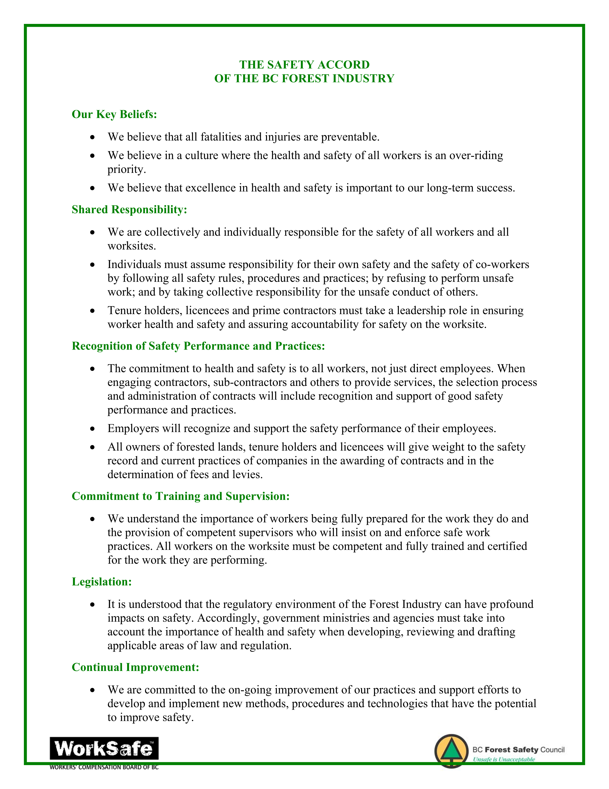
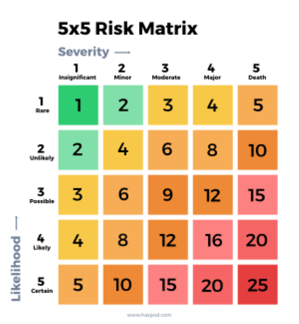

--- 
title: "Occupational Health and Safety Plan"
author: |
 |
 | Prepared for

 |
 |
 | Prepared by
 | Al Irvine, B.Sc., R.P.Bio.
 | New Graph Environment Ltd.

date: |
 |
 | Version 0.0.2 `r format(Sys.Date(), "%Y-%m-%d")`
toc-title: Table of Contents
site: bookdown::bookdown_site
output: 
  bookdown::gitbook:
          includes:
            in_header: header.html
nocite: |

documentclass: book
bibliography: [book.bib, packages.bib, references.bib]
biblio-style: apalike
link-citations: no
github-repo: rstudio/bookdown-demo
description: "My Description."


---

```{r switch-gitbook-html, echo=FALSE}
gitbook_on <- TRUE
gitbook_on <- FALSE  ##we just need turn  this on and off to switch between gitbook and pdf via paged.js

```

```{r setup, echo=identical(gitbook_on, TRUE), include = TRUE}
knitr::opts_chunk$set(echo=identical(gitbook_on, TRUE), message=FALSE, warning=FALSE, dpi=60, out.width = "100%")
# knitr::knit_hooks$set(webgl = hook_webgl)
options(scipen=999)
options(knitr.kable.NA = '--') #'--'
options(knitr.kable.NAN = '--')
```

```{r settings-gitbook, eval= gitbook_on}
photo_width <- "100%"
font_set <- 11

```

```{r settings-paged-html, eval= identical(gitbook_on, FALSE)}
photo_width <- "80%"
font_set <- 9
```


```{r}
source('scripts/packages.R')
source('scripts/functions.R')

```


```{r include=FALSE}
# automatically create a bib database for R packages
knitr::write_bib(c(
  .packages(), 'bookdown', 'knitr', 'rmarkdown'
), 'packages.bib')
```

# Acknowledgement {.front-matter .unnumbered}


Modern civilization has a long journey ahead to acknowledge and address the historic and ongoing impacts of colonialism that have resulted in harm to the cultures and livelihoods living interconnected with our ecosystems for many thousands of years. 


```{js, logo-header, echo = FALSE, eval= T}
title=document.getElementById('header');
title.innerHTML = '' + title.innerHTML
```


<!--chapter:end:index.Rmd-->

---
editor_options: 
  markdown: 
    wrap: 72
---

# Safety Policy

At New Graph Environment we believe that all injuries are preventable
and that safety is the responsibility of everyone. We believe that
getting hurt at work is not acceptable and that by building a culture of
safety we:

-   will look ahead to identify hazards,

-   will document safety procedures and ensure that our management,
    staff and contractors are familiar with them and understand why we
    have them,

-   will strive for continuous improvement to ensure that we learn from
    the past and look to the future to facilitate the safest working
    environment possible for ourselves, our contractors, our clients and
    the public.

## Forest Safety Accord

```{r}

```


## Corrective Action Log

These corrective actions are to be completed by the person indicated,
within the time frame allotted. If more time is required, or there are
difficulties encountered, please contact Allan Irvine for assistance. These comments or corrective actions are based on the quality assurance review by the BC Forest Safety Council.

```{r}
corr_action_log <- readr::read_csv(paste0(getwd(), '/data/corr_action_log.csv'))
corr_action_log %>% 
  fpr::fpr_kable(caption_text = "Corrective Action Log (last updated 2022)",scroll = F)
```                        

## Safety Team Members

As a small company all management and staff are considered safety team
members and expected to integral to the safety program. Feedback is
encouraged as continual improvement is a paramount goal.

## Job Roles and Responsibilities

### Right to refuse work and report unsafe conditions {#right-to-refuse-work-and-report-unsafe-conditions .Style1}

You have the right to refuse unsafe work if you have reasonable cause to believe the work you are doing could create a hazard or cause an injury. Identify hazards before starting work and determine whether it is safe to proceed.
This is work and it is not worth it to risk life and limb.

## COVID 19 Prevention and Risks

We have developed a COVID-19 Safety Plan that outlines the policies,
guidelines, and procedures to reduce the risk of COVID-19 transmission.

All staff, contractors, volunteers, and participants must complete a
self-assessment (<https://bc.thrive.health/covid19/en>) before starting
work each day. If they are experiencing any symptoms related to COVID-19
they must halt all involvement or participation, notify the project
supervisor, and get officially tested.

The virus that causes COVID-19 spreads in several ways, including
through droplets when a person coughs or sneezes, or from touching a
contaminated surface before touching the face. Planning to COVID-19 is a
moving target and should be a continuous effort. Planning is outlined by
WCB
(<https://www.worksafebc.com/en/about-us/covid-19-updates/covid-19-returning-safe-operation>).
Detailed procedures are included in the safe work procedures in the
Appendices of this document and were developed by progressing through
the following steps:

1.  Assess the risk at your workplace to identify places where the risk
    of transmission is introduced

    a.  What job tasks or processes require workers to come into close
        proximity with one another or members of the public?

    b.  What tools, machinery, and equipment do people come into contact
        with in the course of their work?

    c.  What surfaces are touched often, such as doorknobs, light
        switches, equipment, and shared tools?

2.  Implement measures to reduce the risk

    a.  Maintain a distance of 2 metres (6 feet) between workers and
        others wherever possible

    b.  Create pods of workers who work together exclusively to minimize
        the risk of broad transmission throughout the workplace

    c.  Where physical distance cannot be maintained consider the use of
        masks.

    d.  Provide adequate hand-washing facilities on site for all workers

    e.  Develop policies around when workers must wash their hands,
        including upon arriving for work, before and after breaks and
        before and after handling common tools and equipment.

    f.  Implement a cleaning protocol for all common areas and surfaces,
        including washrooms, equipment, tools, common tables, desks,
        light switches, and door handles. Ensure those engaged in
        cleaning have adequate training and materials.

    g.  Remove any unnecessary tools or equipment that may elevate the
        risk of transmission.

3.  Develop policies to manage the workplace

    a.  Anyone who has had [symptoms of
        COVID-19](http://www.bccdc.ca/health-info/diseases-conditions/covid-19/about-covid-19/symptoms)
        in the last 10 days must self-isolate at home.

    b.  Anyone under the direction of the provincial health officer to
        self-isolate must follow those instructions

    c.  When workers or contractors are feeling ill at work they should
        immediately let their supervisor know and go home. If symptoms
        align with those of COVID-19 they should be tested and
        self-isolate until they are symptom free and have a negative
        test result.

## Required safety meetings

### New Worker Orientations {#new-worker-orientations .Style1}

New workers are at a high risk for injuries. They need to know the
safety policies and procedures and demonstrate that they understand how
to protect themselves and others. All employees and dependent
contractors operating under your company's safety plan must review the
New Graph health and safety policies and safe work procedures on their
first day before they start work or when returning to work after an
absence of longer than 6 weeks. Template to be filled out is attached as [Appendix 1](#new-worker).

### Tailboards {#tailboards-site-and-worker-assessment-equipment-and-vehicle-inspection-emergency-contact-list .Style1}

Tailboard meetings are a way to reset at the start of new work tasks to
put safety first as the top priority at all places of work. Our
tailboard template is unique in that it contains documentation of numerous safety policy actions in one place. Tailboards
include references to field safety plans and contain:

-   Site Assessments, Hazard Identifications and Risk Assessments
-   Worker Assessments
-   Personal Protective Equipment Checklist/Inspections
* Machinery Inspection (Vehicle/Trailer/ATV)
-   Emergency Contact List and Info
* Call In/Call Out Numbers for Check-ins
-   Hazard Inspections
-   First Aid Assessments

They are included in this plan as [Appendix 2](#tailboard).

## First Aid equipment and procedures

A level 1 kit is kept under the seat of each work vehicle and our OHSP
is also kept in the truck. The kit should be inspected for contents to
see that it is complete. A weatherproof container is recommended for all items except the blankets. Below is an itemized list of what should be in
the kit:

| **Quantity** | **Required Item**                                                 |
|:-------------|:------------------------------------------------------------------|
| 1            | Blanket                                                           |
| 24           | 14 cm x 19 cm wound cleansing towelettes, individually packaged   |
| 50           | Sterile adhesive dressings, assorted sizes, individually packaged |
| 10           | 10 cm x 10 cm sterile gauze dressings, individually packaged      |
| 4            | 10 cm x 16.5 cm sterile pressure dressings with crepe ties        |
| 2            | 7.5 cm x 4.5 m crepe roller bandages                              |
| 2            | 7.5 cm conforming gauze bandages                                  |
| 1            | 2.5 cm x 4.5 m adhesive tape                                      |
| 2            | Cotton triangular bandages, minimum length of base 1.25 m         |
| 2            | Quick straps (a.k.a. fracture straps or zap straps)               |
| 1            | Windlass style tourniquet                                         |
| 1            | 14 cm stainless steel bandage scissors or universal scissors      |
| 1            | 11.5 cm stainless steel sliver forceps                            |
| 1            | Pocket mask with a one-way valve and oxygen inlet                 |
| 6            | Pairs of medical gloves (preferably non-latex)                    |
| 1            | Waterproof waste bag                                              |
|              | First aid records                                                 |

### Worksite First Aid Requirements {#worksite-first-aid-requirements .Style1}

To determine an adequate and appropriate level of first aid coverage,
the first step is a first aid assessment. This requires a full review of the workplace. The
assessment will help you determine the minimum level of first aid needed
in your workplace. First aid levels are outlined in the [OHS Regulation
Schedule 3-A: Minimum Levels of First
Aid](https://www.worksafebc.com/en/law-policy/occupational-health-safety/searchable-ohs-regulation/ohs-regulation/part-03-rights-and-responsibilities#Schedule3A).

Below are the steps for a first aid assessment.

-   Identify the number of workplaces.

-   Identify your workplace hazard rating.

-   Consider the surface travel time to a hospital.

-   Determine the number of workers on a shift.

-   Determine the required first aid services for your workplace.

-   Review your assessment.

<!--chapter:end:0110-intro.Rmd-->

---
editor_options: 
  markdown: 
    wrap: 72
---

# Plans and Assessments

## Field Safety Plans {#field-safety-plans .Style1}

Field safety plans are written up before traveling to any job site. Information included in these plans include:

* Location and contact info of accommodations where employees are staying.
* Description of personal and company vehicles.
* Crew member contact details, including emergency contacts.
* Personal and crew equipment checklist.
* Location and contact info of nearest hospital.
* Check in and failed check in procedures.
* A brief description of the job, as well as map links and a list of possible locations where crew members will visit.

### Check-in Procedures and Field Communications

Call, text or in reach emergency contact each morning to share the plan
for the day (i.e. name of roads and sites). Agree on a regular daily
check in time and report position/provide updates.

### Procedures for Failed Check-In

If phone call or in reach check-in is not received by agreed upon time,
send text to in reach units, call or text cell phones of field crew
members. If no response please call accommodations, then personal
emergency contacts to see if they have heard anything. Wait 1 hour and
text in reach, text or call cell phones and personal emergency contacts
and accommodations again. Repeat after 2 hours - if no response then
notify the RCMP of a missing persons in field.

## Hazard / close-call / incident reporting requirements and procedures {#hazard-close-call-incident-reporting-requirements-and-procedures .Style1}

Incidents are situations in the workplace that resulted in or could have resulted in injuries, illnesses, or fatalities. Close calls are incidents that almost happened. These can be used to prevent incidents in the future. We have policies in place so that we can document and review close calls. Reporting templates are attached as [Appendix 3](#incident).

## Emergency Response Plan (ERP) and Procedures {#emergency-response-plan-erp-and-procedures .Style1}

**Remote Site Emergency Call-In Procedures**:

-   Dial RCMP
-   Name:
-   Location: (GPS, UTM Co-ordinates, Road Km)
-   Phone \#
-   Nature Of Injury: (severity, what happened, and \# of Victims)
-   Environmental Conditions: (weather, slope, access conditions)
-   Request what you are going to need: (SAR, PEP, Helicopter,)

### Fire Response

-   Regularly monitor the fire weather index using representative
    weather station and determine the appropriate Fire Danger Class for
    the area. For Danger Class Reports go to:
    <http://bcwildfire.ca/Weather/Maps/danger_rating.html>
-   Stop operations and notify he manager and crew immediately upon
    observation of a fire.
-   Manager should either act as the emergency response team leader or
    designate another crew member to assume the emergency response team
    leader role.
-   Call Forest Fire Reporting : 1-800-663-5555 or \* 5555 on the Cantel
    and Telus networks
-   The individual reporting the fire shall remain available to
    communicate details of the fire suppression activity taken and what
    may be required.
-   The remaining crew shall begin immediate action on the fire to their
    level of safety and competence provided it is determined by the
    emergency response team leader that the fire can be safely
    controlled by the crew.
-   The person in charge of the crew during suppression operations will
    continue to supervise the efforts until relieved by
    licensee/contractor representative or BC Wildfire Management Branch
    personnel.

### Landslide, Avalanche, and Natural Disaster Response

-   Ensure all workers are trained and understand response procedures and
    this emergency response plan is available on site at all times.
-   Notify supervisor and other workers. If safe to do so, assess
    situation to determine if activities must be shutdown.
-   Take steps to control further environmental impacts.
-   Supervisors must account for all workers before leaving the site. If
    a shutdown is required, park all equipment in an environmentally
    safe location (avoid riparian management areas, steep side slopes,
    steep road sections, areas with excessive soil moisture, and areas
    within reach of standing timber).
-   Contact appropriate parties if significant environmental damage or
    damage to infrastructure requiring repair has occurred (MFLNRO,
    BCTS, MoTI, etc.).

### Spill Response

**Step 1. Ensure Safety**

-   Assess site hazards to ensure safe work procedures.
-   Notify Site Supervisor and Environmental Monitor (EM).
-   If unsure of the product, consult the MSDS sheets.
-   Eliminate ignition sources if spilled material is flammable.
-   Wear proper personal protective equipment (gloves) contained in the
    spill kit.

**Step 2. Contain the spill**

-   Eliminate the source of the spill.
-   Use contents of the provided spill kit(s) to stop the spread of the
    spill/leak. Absorbent socks can be used to surround the spill.
-   **Remember: White = Fuels & Oils Only, Gray = Universal (Fuels, Oils
    and Chemicals such as antifreeze)**
-   Divert spill away from ditches and watercourses.
-   Once the spill is contained, attempt to soak it up using an
    absorbent pads.
-   Place the absorbent pads and any contaminated soil in a container
    and dispose of it in accordance with the MSDS sheet and provincial
    regulations.

**Step 3. Reporting Requirements**

-   All spills must be reported to the Site Supervisor and the EM. If
    the EM cannot be reached, notify the Provincial Emergency Program
    (PEP) at 1-800-663-3456 if the spill meets the thresholds detailed
    in the Spill Reporting Regulation of BC. A summary of the reporting
    thresholds for the most likely spilled materials is below.

**Spill Reporting Thresholds** Oil Fuel, Oil & Hydraulic fluid: Any
    quantity that enters or is likely to enter water \>100L to land
    Antifreeze: Any quantity that enters or is likely to enter water
    \>25L to land

### Injury

**Minor wounds, breaks, strains:**

-   Ensure site is safe, stabilize patient (provide first-aid),
    transport to closest Hospital, if necessary.

-   Advise office and hospital when you are on route

-   If accident is the result of a motor vehicle accident, please advise
    the RCMP at 250 353 2225

**Serious injury:**

-   Ensure site is safe, then stabilize (provide first-aid) and/or
    prepare patient for transport.

-   Activate SPOT messenger, or call 1 800 461 9911 (if using the
    satellite phone).

-   Provide nature of injuries, location co-ordinates in UTM or
    longitude and latitude for landing site, and communication method to
    use on the way to the accident site.

-   If air evacuation is required, you must advise the communication
    centre you've reached; if road evacuation is used, then advise if
    you will be meeting the ambulance en route.

### Fatality

-   Ensure site is safe
-   Activate SPOT messenger, or call 1 800 461 9911 (if using the
    satellite phone)
-   Contact Nelson WCB at 1 800 663 4962
-   Do not disturb the site, cover the body, ribbon off the area, and
    block access if possible


## Site and Worker Assessments

Conducting a systematic risk assessment will help identify the hazards that exist in the workplace, and how they may
put workers at risk. To determine if we've done enough to protect
our workers, we use a rating system as part of our risk assessment. Risk is calculated by multiplying the likelihood by the severity.

Examples of risks/hazards found in and around job sites include, but are not limited to:

* Wildlife
* Swiftwater
* Vehicle traffic
* Slippery/uneven ground
* Exposure to heat or cold
* Machinery
* ATV (roll over, burns, collision)
* Chemicals
* Chainsaw/loppers/knives
* Electrofisher shocks
* Open water
* Overhead snags and sharp branches

```{r}

```


## Contractor Selection Policy

At New Graph we are responsible to ensure that the contractors we hire
to complete and assist on projects are compliant with the workers
compensation act and have a record that illustrates they have a culture
of safety. For forestry related work, contractors are required to be part of Safe
Certified companies. We have a checklist that we require our contractors
to complete to ensure that they meet our requirements. Our policy is to
always get a clearance letter before and after we receive services from
a contractor to confirm whether they registered with worksafe BC and are
paying premiums. The contractor selection and safety checklist forms are
included as [Appendix 4](#contractor).

Of note, contractors are considered our workers if they do not operate
as an independent business and are either not eligible for WorkSafeBC
coverage or decline to purchase WorkSafeBC's optional coverage. Below
are examples of situations where a contractor would likely be our
worker:

-   The contractor supplies only labour

-   The contractor supplies labour and minor materials

-   The contractor supplies labour and a piece of major equipment but is
    not registered with WorkSafeBC

## Personal Protective Equipment (PPE) policy

All employees will be provided the required PPE when they are hired, and
instructed on its proper use and care. Employees are responsible for
keeping PPE in good working condition and notifying their supervisor if
any PPE no longer meets safe standards.

All PPE must meet regulatory and Canadian Standards Association
standards.

The following provides a *guideline* to the requirements and use of PPE.
A full listing of requirements can be found in the Occupational Health
and Safety Regulation at
<https://www.worksafebc.com/en/law-policy/occupational-health-safety/searchable-ohs-regulation/ohs-regulation/part-08-personal-protective-clothing-and-equipment>

+----------------+-----------------+-------------------------------+
| **PPE**        |                 | **Used in these situations**  |
|                | **Requirements**|                               |
+================+=================+===============================+
| High           | -   The apparel | -   When worker is outside of |
| visibility     |     must be a   |     the vehicle.              |
| clothing       |     color that  |                               |
| (vest)         |     contrasts   | -   On all construction sites |
|                |     with the    |                               |
|                |     environment.|                               |
|                |                 |                               |
|                |                 |                               |
+----------------+-----------------+-------------------------------+
| Limb and body  | -   Must be     | -   When the worker is        |
| protection     |     free of     |     exposed to a substance or |
|                |     holes and,  |     condition that is likely  |
|                |     in the case |     to puncture, abrade or    |
|                |     of hand     |     affect the skin -- or be  |
|                |     protection, |     absorbed through the      |
|                |     made of a   |     skin.                     |
|                |     material    |                               |
|                |     that        |                               |
|                |     provides a  |                               |
|                |     good grip.  |                               |
+----------------+-----------------+-------------------------------+
| Warm dry       |                 | -   All field work            |
| clothing       |                 |     situations. Particularly  |
|                |                 |     in night work and during  |
|                |                 |     seasons of typically      |
|                |                 |     variable and cold wet     |
|                |                 |     weather.                  |
+----------------+-----------------+-------------------------------+
| Wading Belt    |                 | -   Must be worn around waste |
|                |                 |     snugly in conjunction     |
|                |                 |     with waders to ensure     |
|                |                 |     that waders do not fill   |
|                |                 |     with water in the event   |
|                |                 |     of a fall in the water.   |
+----------------+-----------------+-------------------------------+
| Wading Boots   | -   Soft rubber | -   When stream work is       |
|                |     or felt     |     required.                 |
|                |     sole        |                               |
|                |     footwear    |                               |
|                |     specifically|                               |
|                |     designed for|                               |
|                |     stream work |                               |
|                |                 |                               |
|                |                 |                               |
+----------------+-----------------+-------------------------------+
| Polarized      |                 | -   Must be worn while        |
| glasses        |                 |     working in and around     |
|                |                 |     water                     |
+----------------+-----------------+-------------------------------+
| Throw bag and  | -   Must be 15  | -   When worker is working    |
| releasable     |     meters of   |     in/ or around swift water |
| safety rope    |     line.       |                               |
+----------------+-----------------+-------------------------------+
| Personal       | -   Must be     | -   When worker is working    |
| Flotation      |     Canadian    |     in/ or around deep open   |
| Device         |     General     |     water                     |
|                |     Standards   |                               |
|                |     Approved    |                               |
|                |                 |                               |
|                | -   Must be     |                               |
|                |     stored in a |                               |
|                |     dry area.   |                               |
|                |                 |                               |
|                | -   Avoid       |                               |
|                |     exposure to |                               |
|                |     sunlight.   |                               |
+----------------+-----------------+-------------------------------+
| Hard hats      | -   High-       | -   Must be worn in any work  |
|                |     visibility, |     area where there is a     |
|                |     hardhat.    |     danger of head injury     |
|                |                 |     from falling, flying or   |
|                | -   Cleaned     |     thrown objects, or other  |
|                |     regularly   |     harmful contacts.         |
|                |     and stored  |                               |
|                |     away from   | -   Must be worn on all       |
|                |     grease and  |     construction based job    |
|                |     tools.      |     sites.                    |
+----------------+-----------------+-------------------------------+
| Helmets        | -   Must be DOT | -   Must be worn when         |
|                |     approved    |     operating ATV/            |
|                |                 |     snowmobile.               |
|                | -   Must be     |                               |
|                |     free of     |                               |
|                |     cracks,     |                               |
|                |     dents or    |                               |
|                |     any other   |                               |
|                |     damage.     |                               |
+----------------+-----------------+-------------------------------+
| Eye and face   | -   Safety      | -   Safety eyewear must be    |
| protection     |     eyewear     |     worn when working in      |
|                |     must fit    |     conditions that are       |
|                |     properly    |     likely to injure or       |
|                |     and include |     irritate the eyes.        |
|                |     side        |                               |
|                |     shields     | -   Face protectors must also |
|                |     when        |     be used if there is a     |
|                |     necessary   |     risk of face injury such  |
|                |     for worker  |     as when operating a chain |
|                |     safety.     |     or brush saw.             |
+----------------+-----------------+-------------------------------+
| Safety         | -   Must be of  | -   Appropriate footwear must |
| footwear       |     a design,   |     consider the following    |
|                |     construction|     factors: slipping, uneven |
|                |     and material|     terrain, abrasion, ankle  |
|                |     appropriate |     protection and foot       |
|                |     to the      |     support, crushing         |
|                |     protection  |     potential, temperature    |
|                |     required for|     extremes, corrosive       |
|                |     the work    |     substances, puncture      |
|                |     environment |     hazards, electrical       |
|                |                 |     shock, and any other      |
|                |                 |     recognizable hazard.      |
|                |                 |                               |
|                |                 | -   Toe and metatarsal        |
|                |                 |     protection, puncture      |
|                |                 |     resistance, and/or        |
|                |                 |     dielectric protection     |
|                |                 |     must be used where        |
|                |                 |     appropriate.              |
|                |                 |                               |
|                |                 | -   Caulked or other equally  |
|                |                 |     effective footwear must   |
|                |                 |     be worn by workers who    |
|                |                 |     are required to walk on   |
|                |                 |     logs, piles, pilings or   |
|                |                 |     other round timbers.      |
+----------------+-----------------+-------------------------------+
| Hearing        | -   WorkSafeBC's| -   If those levels cannot be |
| protection     |     regulations |     practicably met, the      |
|                |     regarding   |     employer must:            |
|                |     noise       |                               |
|                |     exposure    |     -   Reduce levels as low  |
|                |     are:        |         as possible           |
|                |                 |                               |
|                |                 |     -   Provide to workers    |
|                |     -   85dBA   |         hearing protection    |
|                |         Lex     |         that meets CSA        |
|                |         daily   |         standards, and ensure |
|                |         noise   |         it is worn            |
|                |         exposure|         effectively in noise  |
|                |         level   |         hazard areas          |
|                |                 |                               |
|                |     -   140 DBC |                               |
|                |         peak    |                               |
|                |         sound   |                               |
|                |         level   |                               |
+----------------+-----------------+-------------------------------+
| Bear Spray /   | -   Always worn | -   Must be readily available |
| Bangers        |     in remote   |     in case of any bear       |
|                |     locations   |     sighting.                 |
|                |                 |                               |
|                | -   Inspected   | -   Must be carried for all   |
|                |     regularly   |     remote worksites or       |
|                |     and stored  |     worksites where there is  |
|                |     in a safe,  |     potential bear activity.  |
|                |     dry place.  |                               |
|                |                 | -   Ensure equipment has      |
|                |                 |     current use by date       |
|                |                 |     attached.                 |
+----------------+-----------------+-------------------------------+

## WHMIS orientation and location of the Material Safety Data Sheets (MSDS)

## Records of Training

A training log of all employee training/certifications can be found in the data folder [here](https://github.com/NewGraphEnvironment/hsp/blob/master/data/training_log.csv).

## Progressive discipline policy

Actions and behaviors that create or facilitate unsafe working
environments and elevate the risk of injury to company representatives,
contractors and the public are unacceptable. To ensure that these
actions and behaviors do not persist once identified, the following
progressive discipline policy has been implemented.

1.  Verbal Warning

2.  Documented Warning

3.  Letter of Reprimand

4.  Discharge

<!--chapter:end:0200-plans-assessments.Rmd-->

---
editor_options: 
  markdown: 
    wrap: 72
---

# Safe Work Procedures and Practices

## Driving {#driving .Style1}

### Procedures and Practices

-   Conduct a "pre-trip" vehicle check. Use a Vehicle Pre-trip
    Inspection and Mileage Log to track activity.Report deficiencies and do not use if equipment is in     unsafe condition.

-   Make notes of required maintenance in the mileage logbook when it is
    required and include "checking the logbook for required repairs" at
    the time of each inspection.

-   Drive defensively at all times.

-   Ensure all vehicle occupants are wearing seatbelts. You are
    responsible for your passengers.

-   Do not exceed posted speed limits.

-   On resource roads do not exceed 80kph or posted speed limits.

-   Drive safely and drive to the existing road conditions. Lower speed
    as required. Be aware of:

    -   Visibility reduced by dust, fog, rain and snow;

    -   Narrow roads with over width vehicles;

    -   Steep favorable and adverse gradients;

    -   Slippery and variable road surface conditions due to loose
        gravel, snow, ice or mud;

    -   Other users.

-   Use vehicle for intended use only (purpose and weight limitations).

-   Drive with vehicle lights on at all times.

-   Secure all heavy or sharp objects in the cab of the vehicle.

-   Respect that loaded logging trucks have the right of way on single
    lane roads.

-   Tailgating is driving too close behind other vehicles. It is extremely cangerous as it can lead to accidents if they vehicle in front of you brakes suddently or is in a collision/crash you can smash into them.  Leave a sufficient distance in front of the vehicle in front of you, even more so for logging trucks.  A good rule of thumb is to leave 3-4 seconds of time between when the vehicle in front of you passes a specific location and when you pass it.

-   Pass trucks or equipment only after you receive a clearly visible and/or audible signal from the operator.

-   Never chase a runaway vehicle.

-   Stay on your side of the road.

    **COVID 19 (COVID)**

    -   [Self-assess daily for COVID
        symptoms](https://bc.thrive.health/covid19/en) and self-isolate
        and test if you have symptoms.

    -   When possible, travel in separate vehicles. When a crew is
        required to travel together, sit in seats as far from eachother
        as possible, wear masks and when possible leave the windows open
        for good ventilation.

    -   All vehicles need to have paper towel, min 70% alcohol hand
        sanitizer and non-medical grade masks. Ensure this is present
        before leaving.

    -   When getting in vehicle wipe down all initial touch points with
        min 70% alcohol and paper towel (ex. Vehicle door, radio,
        steering wheel, shifter, seat belt). Sanitize all surfaces of
        both hands.

    -   After opening vehicle door at all stops and worksites use hand
        sanitizer on surfaces of both hands. Put on non-medical mask if
        entering building (ex. Gas station, restaurants) or working with
        others where you cannot keep min 2m distance. Upon exiting
        vehicle close door with elbow.

### Radio Use

-   Complete radio check and ensure correct frequency prior to entering
    radio controlled area.

-   Do not drive by the radio. Expect oncoming traffic at all times.

-   Call your position according to the local radio protocol and
    signage.

-   Notify other radio equipped vehicles of oncoming non-radio equipped
    traffic.

-   Do not use road radio channels for conversations, use only for road
    traffic protocols.

-   Other than traffic control, pull over and safely park when talking
    on the radio for an extended period of time.

### Parking and Key Management

* When working in the field, it is important to manage your keys. Always carry a spare key and keep it hidden somewhere on the vehicle that can be accessed if keys are lost. As a good practice and particularly important if you do not have a spare key - hide primary keys somewhere on your vehicle. Choose a location that is hard to see but easy to reach (ex: in gas cap or under bumper). Notify your co workers where they are in case of emergency.

-   Park clear of traffic, away from active areas in pullouts or extra
    wide straight sections of road.

-   Park facing the direction of exit with access for service/towing
    activities.

-   Ensure the parking brake is on and the transmission is in 1st gear
    or park.

-   On steep grades, use wheel chocks and always turn the wheels towards
    the nearest ditch.

-   Never park on a curve especially on the outside curve of a road.

-   When turning around, back into the cut bank of the road and not
    towards the outside bank.

-   Use flares where required.
  

## All-terrain vehicles {#all-terrain-vehicles .Style1}

```{r}
knitr::include_graphics('fig/media/all_terrain_vehicles.png')
```

## Electrofishing {#electrofishing .Style1}

### Preparatory Procedures

1.  A crew leader must be designated for all backpack electrofishing
    activities.

2.  It is the crew leader's responsibility to ensure that all equipment
    is in "safe working order".

3.  An emergency response plan must be prepared and reviewed with all
    crew members.

4.  The crew leader must ensure all crew members have received
    instruction in the fundamentals of electrofishing safety.

5.  The crew leader and at least one additional crew member must have
    up-to-date CPR and First Aid training.

6.  Each electrofishing site must be visually inspected for hazards such
    as deep holes, submerged logs, etc. before commencing electrofishing
    operations.

7.  In order to aid in identifying underwater hazards, all crew members
    must be equipped with polarized sunglasses. Glasses also protect
    against eye injury caused by sticks and branches. Wide brimmed hats
    or peaked caps are also beneficial in increasing the effectiveness
    of polarized glasses.

8.  All crew members must be equipped with long armed gloves that are
    non-conductive, waterproof and inspected to be free of leaks. Gloves
    must be worn at all times during electrofishing operations.

9.  All crew members must be equipped with chest waders that are
    non-conductive, waterproof and inspected to be free of leaks. Chest
    waders must be worn at all times during electrofishing operations by
    team members entering the water. Wading belts are to be worn at all
    times.

10. All crew members must agree on a system of communication during
    electrofishing operations.

11. Backpack electrofishing units must be turned off and the battery
    disconnected before making any connections or part replacements.
    Start-up Procedures

12. All crew members must be notified and acknowledge their preparedness
    prior to the commencement of electrofishing operations. The unit
    operator must make sure that personnel are clear of the anode before
    turning on the power. Hand signals are a useful way of conveying
    these messages.

13. Check operation of all switches and gauges. This should include high
    voltage check, anode switch, power switch and mercury tilt switch,
    audible tone generator and light. Set controls to appropriate
    levels. The minimum voltage possible to obtain the desired results
    should be used to avoid excessive harm to the biota and to minimize
    the effects of accidental shock.

### Operational Procedures

14. Operate slowly and carefully. Footing in most streams is poor and
    most falls occur when crew members are hurrying. Operations should
    cease when fatigue sets in.

15. Team members must not place their hand(s) into the water when the
    power is turned on.

16. Electrofishing units must be shut off prior to entering or leaving
    the water and the battery terminals disconnected (or generator shut
    off) when not in use or when transporting the unit.

17. Life jackets or Personal Floatation Devices (PFDs) must be worn
    where the crew leader considers the water is of sufficient depth or
    velocity for a life jacket or PFD to be effective as protection from
    risk of drowning. Life jackets and PFDs must be approved by
    Transport Canada or Canadian Coast Guard. Electrofishing should not
    be carried out where water depth is greater than waist deep.

18. A crew member must immediately leave the water if wetness is
    detected in gloves or waders (by leaks, rain or perspiration) and
    obtain dry equipment before returning. Mild dampness from
    perspiration or humidity is considered normal.

19. Electrofishing operations must cease during inclement weather. (e.g.
    periods of any lightning or moderate rain).

**COVID 19**

-   As electrofishing often requires the "fisher" and "netter" to be
    within 2m of eachother masks are required to be worn by both crew
    members.

-   Wear disposable gloves when assembling equipment or wipe down all
    touch points after assembly.

## Culvert assessments and habitat confirmation assessments {#culvert-assessments-and-habitat-confirmation-assessments .Style1}

See driving procedures including radio use and parking.

-   Sometime parking on the shoulder of resource roads is the only
    practical way to assess a site. When doing so place a traffic cone
    2m behind the back left wheel to alert oncoming traffic.

-   Wear waders and wading boots or a non-slip rubber boot when working
    in the stream. Carefully assess your footing and be ready for
    slippery surfaces.

-   Use 2 walking poles when conducting in stream surveys. Always maintain 3 points of contact with poles and your feet. This allows
    for much greater stability and avoids the risk of injury. As the in
    stream substrate typically consists of cobbles and boulders, it can
    be very painful when falling. Be cautious of foot placement to lower risk of foot entrapment. Poles are often used in photos to have
    a frame of reference for measurements of stream characteristics. One
    pole can be used for scale, while the other one can remain in hand
    as a stabilizer.

-   Carry bear spray with you at all times when in the field. You never
    know when you'll need to use it.

-   Always carry personal first aid kit, water, extra clothes, inreach
    satellite communicator and food (ex. Power bar) in your vest in case
    of an emergency.

-   High visibility field vest should be worn to avoid being mistaken
    for an animal by hunters.

-   Navigating to sites often requires the use of handheld devices such
    as phones, two-way radios or GPS which should either be used by a
    non-driving crew member or mounted on the windshield where they can
    be viewed without distracting the driver.

-   Touching base with the call in person throughout the day is
    essential so that your last known location is known and to minimize
    the potential for false alarms should you not check in on time at
    the end of the day. Inreaches should be tested between crew members
    and between crew members and check in people before going in the
    field.

## Working Alone

Working alone means working in circumstances where assistance would not be readily available to the worker in case of an emergency. There can be circumstances in the field where the worker will be conducting a survey alone. The lone worker must abide by the following procedures:

* Designate a contact person to check in with on a pre planned schedule. Arrange a meet up time and place before getting separated. 

* The worker must carry a functioning communication device such as a cell phone, two-way radio, and a inreach satellite communicator. Carrying all three is highly recommended.  

* Carry bear spray. Make a lot of noise periodically to alert bears in the area of your presence. Optionally, it can be effective to have a bluetooth speaker to play music.
    
* If the lone worker fails to check in, then the contact person must initiate search procedures. See Procedures for Failed Check-In section of Field Safety Plan. 

## Wildlife Encounters 

### Bears {#bears .Style1}

+---------------------+-----------------------------------------------+
| **Situation**       | **Recommended actions**                       |
+=====================+===============================================+
| Bear does not know  | Move away undetected.  Go back the way you    |
| you are there       | came or take large detour around. If you must |
|                     | go ahead do so slowly and cautiously. DO NOT  |
|                     | RUN                                           |
|                     |                                               |
|                     | Keep your eye on the bear.                    |
|                     |                                               |
|                     | Watch for changes in behavior.                |
|                     |                                               |
|                     | Be careful not to crowd or surprise bear      |
|                     | (especially Grizzlies).  Do not shout if it   |
|                     | is unaware of your presence.                  |
+---------------------+-----------------------------------------------+
| Bear becomes aware  | Calmly and from as far away as possible       |
| of you              | identify yourself as human.                   |
|                     |                                               |
|                     | Talk to the bear in a low, respectful voice.  |
|                     |                                               |
|                     | Wave your arms slowly.                        |
|                     |                                               |
|                     | Increase the distance between you and the     |
|                     | bear.                                         |
|                     |                                               |
|                     | If possible, move upwind to give the bear     |
|                     | your scent.                                   |
|                     |                                               |
|                     | When bear is aware and unconcerned take the   |
|                     | opportunity to leave. Do not run.             |
+---------------------+-----------------------------------------------+
| If you hear bear    | Be extremely cautious and leave the area the  |
| vocalizations or    | way you came.                                 |
| see young bears in  |                                               |
| area                |                                               |
+---------------------+-----------------------------------------------+
| If bear approaches  | Stop, stay calm, and assess the situation: is |
| you                 | bear acting defensively (grunting, or another |
|                     | way?                                          |
|                     |                                               |
|                     | Don't run.                                    |
|                     |                                               |
|                     | Group together if possible.  Prepare          |
|                     | deterrent (mace).                             |
|                     |                                               |
|                     | Determine if bear is **defensive or           |
|                     | aggressive.**                                 |
+---------------------+-----------------------------------------------+
| Bear approaching in | **Defensive bears are threatened or may be    |
| a defensive         | protecting food. They show stressed behaviour |
| (stressed) manner   | such as rapid huffing, salivating, roaring,   |
|                     | paw slapping, guttural noises, open mouthed   |
|                     | jawing and charging.**                        |
|                     |                                               |
|                     | When bear approaches or charges stand your    |
|                     | ground (physical contact is rare). Most       |
|                     | charges stop short.                           |
|                     |                                               |
|                     | Appear non-threatening.                       |
|                     |                                               |
|                     | Talk to bear in calm voice and let it know    |
|                     | you mean it no harm.                          |
|                     |                                               |
|                     | Don't shout or throw things acting            |
|                     | defensively.  Try to increase distance        |
|                     | between you and the bear (keep your eye on    |
|                     | it).  Do not run.                             |
|                     |                                               |
|                     | Use deterrent only as last defense.           |
+---------------------+-----------------------------------------------+
| In the case of a    | If bear physically contacts you in a          |
| defensive attack    | defensive attack play dead: fall on ground on |
|                     | your front, protect your neck.  If rolled     |
|                     | over continue to roll over to face.  Stay on  |
|                     | ground till bear leaves.  If attach is        |
|                     | prolonged it is no longer defensive.          |
+---------------------+-----------------------------------------------+
| Bear approaching in | **Non defensive bears show little stress.     |
| **non-defensive**   | They look interested in you and intent on     |
| manner              | approaching you. Watch towards you            |
|                     | confidently looking towards you               |
|                     | intermittently. They seem intent on attack.** |
|                     |                                               |
|                     | If approached move away from bears path or    |
|                     | trail.                                        |
|                     |                                               |
|                     | If bear is intent on you stand your ground.   |
|                     | **Your response needs to be assertive.**      |
|                     |                                               |
|                     | Act aggressively: shout at bear, stare it in  |
|                     | the eye, stamp feet, stand on stump or log,   |
|                     | threaten bear with stick or log.              |
|                     |                                               |
|                     | If attacked use deterrent, fight with any     |
|                     | weapon available with all your strength.      |
|                     | Focus attack on bear's face.                  |
+---------------------+-----------------------------------------------+

Staying safe in bear country video:
<https://www.youtube.com/watch?v=s-zkGuh42l4&ab_channel=bearbiology>

### Cougars

* Make a lot of noise when working and walking
* Avoid cougar kills. Cougars cover their kills with dirt and leaves and return later. Be aware for circling birds and other scavengers; these could indicate there is a kill site nearby.
* **If you encounter a cougar:**
  + Don't run, this might trigger a pursuit
  + Don't turn your back, always keep the cougar in front of you
* **If the cougar shows interest in you** (staring, crouching, creeping, tail twitching):
  + Make eye contact
  + Make yourself look big
  + Show your teeth, pretend to be a predator
  + Make loud noises
  + Arm yourself with anything you can find
* **If the cougar attacks:**
  + Fight back, convince the cougar you are the predator and not the prey
  + Yell or make loud, intimidating noises
  + Focus your attacks on the cougar's nose, face, and eyes

### Moose

A moose will charge to ward off a potential threat. Assure the moose that you are not a threat.

* **Signs of an aggressive moose:**
  + Walking in your direction
  + Stomping its feet
  + Peeling its ears back
  + Grunting
  + Throwing its head back and forth
* **How to prevent and survive a moose attack:**
  + Back away with palms facing the moose
  + Speak softly and reassuringly to it
  + If the moose charges then get behind a large tree or rock, most moose charges are bluffs
  + If the moose attacks you then fake death by curling up in a ball, protect your neck and back

## Remote Working

Approximately 75% of the work done at New Graph Environment is remote from the employee's home. Safe work practices are still important when working remotely. 

### Ergonomics

Ergonomics are an important part to any home office. Your home work space should meet basic ergonomic requirements in order to decrease risk of long term injuries. Listed below are a few guidelines:

* It starts with a good chair. Ensure your chair is properly adjusted so that your wrists are straight, with hands below or at elbow level, knees are level with hips and thighs parallel to the floor, feet are flat on the ground, and the top of your computer display is positioned at or just below eye level. Get a chair with proper lumbar support.
* Invest in a good mouse and keyboard that offer good wrist support and comfort.
* Buy a proper desk that has enough room for all your equipment and is of appropriate height. Adjustable desks are a good option since you can switch between sitting and standing positions.
* Do not sit in one place all day long. Make sure you get up and walk around and/or stretch throughout the day to relieve muscle and joint pain. 

### Mental and Physical Health

When working remotely, it is important to maintain your mental and physical health. 
Listed below are a few ways to reduce stress and improve your mental and physical health:

* Stick to a regular work routine and schedule every day, and switch off on your down time.
* Take a break every now and then to get up and walk around. 
* If a task you're working on is causing you too much stress then don't be afraid to delegate or ask for help, avoid burnout and overworking yourself.
* Stick to a good work life balance, make time for socialising and enjoying your favorite hobbies/physical activities.
* Sun exposure is limited when working inside and it can therefore be hard to get your daily Vitamin D requirements, consider taking a supplement.
* Seasonal affective disorder can affect everyone and can cause a decrease in energy levels and change in mood in the winter time, ensure you go outside everyday and engage in regular physical activity to reduce stress levels.
* When leaving the house to go to a work related meeting be aware of road conditions when driving, even when walking (steer clear of ice to avoid nasty falls).

<!--chapter:end:0300-safe-work-procedures.Rmd-->

# Appendices {.unnumbered}

## [Appendix 1 - New Worker Orientation](data/form_templates/new_worker_orientation_checklist_20200311.pdf) {#new-worker .unnumbered}

## [Appendix 2 - Tailboard Template](data/form_templates/Tailboard_Template_201908.pdf) {#tailboard .unnumbered}

## [Appendix 3 - Incident/Close Call Template](data/form_templates/frm_xIncidentCloseCallReporting.pdf) {#incident .unnumbered}

## [Appendix 4 - Contractor Selection and Safety Checklist](data/form_templates/20_ContractorSelectionAndSafety_checklist.pdf) {#contractor .unnumbered}


 


<!--chapter:end:0400-appendices.Rmd-->

`r if (knitr::is_html_output()){ '
# References {-}
<div id="refs"></div>
'}`

```{r}
#https://github.com/rstudio/bookdown/issues/8 how to put the references wherever we want.

# `r if (knitr::is_html_output()){ '
# # References {-}
# <div id="refs"></div>
# '}`
```


<!--chapter:end:2000-references.Rmd-->


# Session Info {-}


```{r session info, comment="", class.source = 'fold-show'}
xfun::session_info()
```

<!--chapter:end:2100-session-info.Rmd-->

